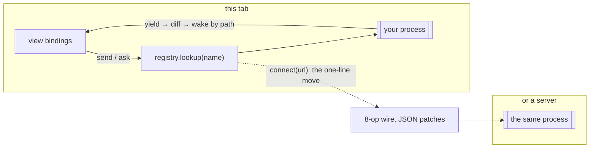

# Nonchalant

A UI library built on one primitive. You write a **process** as an async
generator — its state is plain `let` variables, its input is a mailbox, and
everything it `yield`s is published. `spawn` runs it and hands you a live,
typed handle: call it to read, `send` it messages, `ask` it questions, iterate
it, dispose it. State is a process of data; a view is a process of UI; a
server actor is a process on the other end of a socket. Same handle, same
lifecycle, same rules.

```ts
import { spawn } from '@nonchalant/core'
import type { Self } from '@nonchalant/core'
import { mount } from '@nonchalant/dom'
import { button, div, span } from '@nonchalant/dom/tags'

const counter = spawn(async function* (self: Self<number>) {
  let n = 0                          // this is the state
  yield n
  for await (const d of self) {      // this is the input
    n += d
    yield n                          // this is the output
  }
}, undefined, { initial: 0 })

mount(document.getElementById('app')!, div({},
  button({ onclick: () => counter.send(-1) }, '−'),
  span({}, counter),                 // a live binding
  button({ onclick: () => counter.send(1) }, '+')))
```

## Why it's interesting

- **No render loop.** A view runs once and returns a tree of bindings. Updates
  flow through the graph to exactly the DOM they touch — CI asserts that
  changing one label in a 50-row list is exactly one DOM write, and that a
  60 fps game demo stays within one view yield and ≤ 3 DOM writes per frame.
- **Fine-grained without a compiler.** You write ordinary immutable updates;
  every yield is diffed structurally, and readers wake only if a path they
  actually read changed. No proxies on your writes, no annotations, no build
  step.

```ts
s = { ...s, total: s.total + item.price }   // an ordinary immutable update
yield s                                     // diffed → only /total readers wake;
                                            // a binding on items[3].done sleeps through it
```

- **The mailbox serializes work by default.** A double-submit queues instead of
  racing; `latest()` conflates queued input to the newest value, while the abort
  signal handles lifetime cancellation.

```ts
for await (const { q } of self.latest()) {          // queued keystrokes conflate to the newest
  results = await api.search(q, { signal: self.signal })
  yield { q, results }
}
```

- **Request/response is typed end to end.** A message that expects an answer
  is a `Call`; `ask()` returns the reply as a promise and rejects if the
  process crashed. The compiler refuses to `send` a call or `ask` a cast.

```ts
type CartMsg =
  | { type: 'add'; item: Item }                                   // a cast
  | Call<{ type: 'checkout' }, { ok: boolean; charged: number }>  // a call

const res = await cart.ask({ type: 'checkout' })   // res is typed; crash = rejection
```

- **State has an address.** `lookup` is get-or-spawn: the first caller starts
  the process, everyone else shares it. One operation is dependency injection,
  a query cache, and remote addressing — TanStack's core is a definition with
  an evict time.

```ts
const shop = registry({ user: define(userProc, { evict: 30_000 }) })
const u = shop.lookup('user', { id: 1 })   // deduped, shared, refcounted, idle-evicted
u.pending; u.error; u()                    // loading and failure are the process face
```

- **Location transparency, for real.** `connect(url)` returns the same
  registry interface. The pitch demo (`examples/shared-cart`) moves state from
  the tab to a server by changing one line — the process code doesn't change,
  because it never knew which side of the wire it was on.

```ts
const shop = registry({ cart: define(cart) })                  // state lives in this tab
// const shop = connect<Shop>(webSocketTransport('wss://…'))   // …or on a server. Same cart.
```

- **Processes test as transcripts.** `Self` is an interface and `channel()`
  implements it, so a process tests as the plain generator it is — no
  runtime, no fake timers, no DOM ([docs/testing.md](docs/testing.md)).

```ts
const self = channel<Msg>()                  // a scripted mailbox
self.send({ type: 'add', title: 'milk' })
const it = todosProc(self, undefined)
expect((await it.next()).value.todos).toHaveLength(1)
```



- **A language-agnostic wire.** Eight JSON ops carrying state patches — never
  markup, never code. The conformance vectors in `packages/wire/spec/` are the
  contract; any language can implement the host half.
- **Small.** Core is 6.2 KB gzipped; core + DOM + tags is 10.6 KB. Both are CI
  budgets, not aspirations.

## Compared to what you know

| | you write | state lives in | updates happen by | state addressable over the wire |
|---|---|---|---|---|
| **React** | functions, re-run every update | hooks | re-render + vdom diff | no |
| **Solid** | functions, run once | signals / stores | fine-grained graph | no |
| **Svelte 5** | compiled components | `$state` runes | compiler-injected updates | no |
| **Crank** | generator components + JSX | plain locals | re-render + vdom diff | no |
| **LiveView** | server templates | server assigns | HTML diffs over the wire | server-only |
| **nonchalant** | generator processes | plain `let` locals | yield → diff → wake by path | yes — a name resolves at any distance |

Every row is a different set of trade-offs, not a scoreboard. What nonchalant
gives up is listed in the [migration guide](docs/migration.md): no JSX
ergonomics without an adapter, explicit thunks for reactive expressions, no
BEAM-style preemption.

## Try it

```sh
pnpm install
pnpm dev       # opens the example gallery
pnpm test      # the whole suite, including the perf/size/granularity budgets
pnpm check     # strict TypeScript across packages and examples
```

## Learn it

| doc | what it is |
|---|---|
| [Thinking in processes](docs/tutorial.md) | the tutorial — build a cart, end with it on a server |
| [Concepts](docs/concepts.md) | the reference: each concept, its contract, its tests |
| [Recipes](docs/recipes.md) | typeahead, forms, query cache, routing, undo/redo, drag |
| [Testing](docs/testing.md) | driving generators directly, transcripts, views as data |
| [Migration](docs/migration.md) | coming from React, Solid, or LiveView |
| [Protocol](docs/PROTOCOL.md) | the wire spec, for any language |
| [Examples](examples/README.md) | the demo ladder |

## Packages

| package | contents |
|---|---|
| `@nonchalant/core` | `Process`, `spawn`, `derive`, the registry, `reconcile`, the reactive graph. Zero dependencies, no DOM. |
| `@nonchalant/dom` | tag constructors, `h()`, the DOM sink, keyed reconciliation, `mount`. |
| `@nonchalant/wire` | the protocol, codec, transports (WebSocket, BroadcastChannel, in-memory), `connect`. Isomorphic. |
| `@nonchalant/host` | the Node host: `serve(defs)` over WebSockets. |

## Credits and prior art

- [alien-signals](https://github.com/stackblitz/alien-signals) (Johnson Chu,
  MIT) — the push–pull propagation core is a faithful port; the path-precision
  layer sits on top of it, untouched.
- [Crank.js](https://crank.js.org) — a major influence: the proof that
  generator components with plain-local state feel right. Nonchalant keeps the
  generator and swaps the vdom re-render for fine-grained bindings, a mailbox,
  and the wire.
- **Erlang/OTP** — mailboxes, casts vs calls, restart-from-init-args,
  supervision by ownership, and the registry-of-named-processes idea.
- **The Elm architecture** — the model/update/view lineage several of the
  examples follow.
- **Solid** and **lit-html** — prior art for the localized keyed diff.
- **Phoenix LiveView** — prior art for server-held UI state; nonchalant's wire
  carries data patches instead of HTML.
- **TanStack Query** — the cache lifecycle (keys, sharing, refcounting, idle
  eviction) that the registry set out to reproduce in twenty lines.
- [7GUIs](https://eugenkiss.github.io/7guis/) (Eugen Kiss), **TodoMVC**, and
  the [krausest js-framework-benchmark](https://github.com/krausest/js-framework-benchmark)
  — the example and benchmark suites implemented in `examples/`.

MIT © Tim Farland
