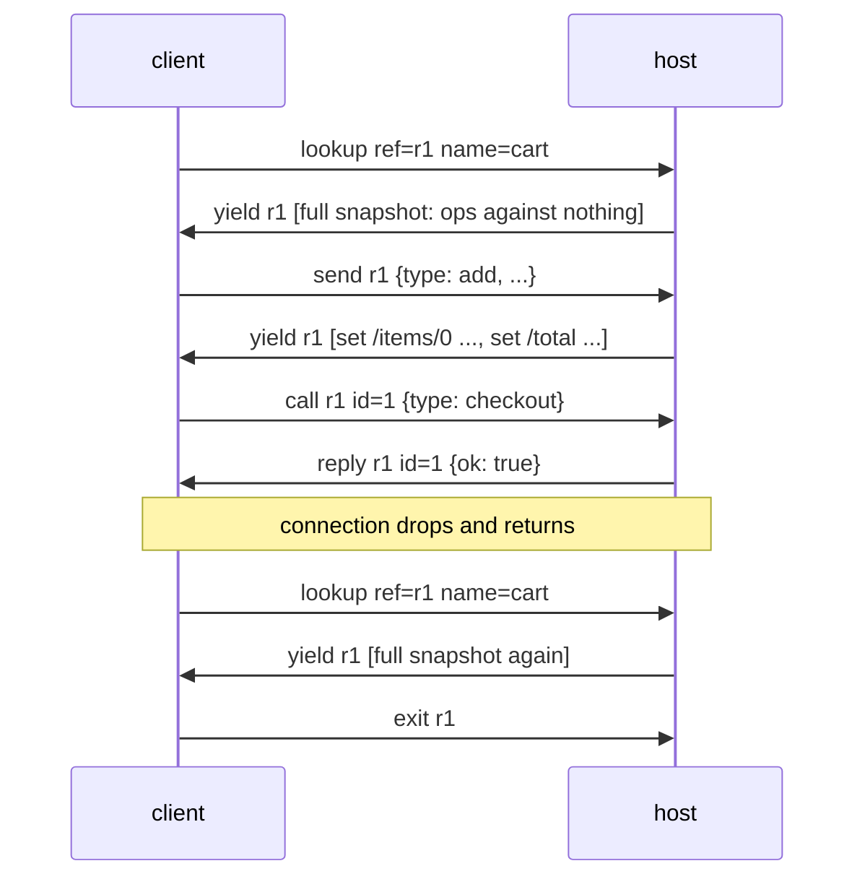

# The Nonchalant wire protocol (rev 2)

The protocol works over any ordered, reliable transport, including WebSocket,
BroadcastChannel, worker ports, and in-memory channels. It carries **plain-data
state patches rather than markup or code**. Any language can implement a host;
this file and the conformance vectors
(`packages/wire/spec/vectors/*.json`, format in `packages/wire/spec/README.md`)
are the contract. External hosts certify against the same vectors the reference
implementation runs in CI (`packages/wire/test/vectors.test.ts`).

## Messages

Client → host:

    { op: "lookup", ref, name, args? }  // get-or-spawn by schema name; args are data
    { op: "send",   ref, msg }          // cast: fire-and-forget
    { op: "call",   ref, id, msg }      // ask(): correlated request
    { op: "exit",   ref }               // release this watch; see Semantics for reclamation

Host → client:

    { op: "yield",  ref, patch }        // reconcile(prev, next) since the previous yield
    { op: "reply",  ref, id, value }
    { op: "done",   ref, value? }       // normal completion
    { op: "raise",  ref, error }        // failure; see the error shape below

`ref` is a client-chosen opaque string. On shared-bus transports, clients make
refs globally unique (the reference implementation prefixes a per-session id).

## A session

## Patch grammar

    Patch = Op[]                        // applied in order
    Op = ["set",    path, value]
       | ["del",    path]
       | ["splice", path, start, remove, insert[]]

- `path` is an RFC 6901 JSON pointer: `""` is the root, `"/items/3/done"`
  descends; `~` and `/` inside keys are escaped as `~0` and `~1`. Hosts MUST
  reject malformed escapes (`~` followed by anything other than `0` or `1`).
- Every JSON key is valid, including `__proto__`, `constructor`, and
  `prototype`. Implementations MUST create own data properties without invoking
  prototype setters (the reference implementation uses `defineProperty`).
- The first `yield` after **any** lookup is a full snapshot: ops applied
  against an empty previous state. A lookup on a ref that is already being
  watched restarts the watch the same way. Reconnect is therefore not a
  special case: the client re-issues its lookups and receives full snapshots,
  which it diffs against whatever it kept.

## Errors

`error` is a Json value. Two conventions:

- **Call rejection**: when `error` is an object carrying a numeric `id`, the
  raise rejects exactly that pending call and nothing else. The host sends
  this when a call fails, is dropped by mailbox overflow, or targets an
  unknown ref.
- **Process failure**: an `error` without an `id` means the process itself
  failed. Clients keep the last value (readers see `stale: true`) and reject
  all pending calls for the ref. No further yields arrive until a re-lookup.

The reference implementation emits `{ message, id? }`; hosts may add fields.
A lookup for a name outside the schema MUST answer with a process-level raise,
and a lookup a host refuses for resource reasons (a per-session watch cap, for
example) answers the same way. The ref never becomes watched.

## Semantics

- `lookup` is get-or-spawn against the host's **published schema**. The schema
  is simultaneously the type contract and the security whitelist. Nothing
  outside it can be spawned remotely.
- `exit` releases the client's watch, not the process. Whether the process is
  then reclaimed is the host registry's business: the reference implementation
  disposes it once no watcher remains *and* its definition declares an idle
  timeout, so a definition without one stays resident until the host evicts it.
- One `reply` per `call` id; a crashed process rejects its pending calls
  rather than silently retrying.
- Casts arriving while a process is restarting are retained in a bounded
  mailbox and replayed; the overflow policy is drop-oldest (a dropped call
  is rejected).
- Ordering: per-ref FIFO both directions. No cross-ref ordering guarantees.
- Yields may be conflated: a host that observes state lossily (latest-value)
  sends patches between consecutive *observed* snapshots. Patches always
  compose; clients cannot tell the difference.

## Transports

A transport carries opaque strings, ordered and reliably, and reports
open/close. Two additional rules for shared buses (e.g. BroadcastChannel),
where every peer hears every message:

- Peers MUST ignore anything that does not decode as a message addressed to
  their side (the codec's direction filtering makes a bus safe).
- The literal string `nonchalant:announce` is not a message: a host posts it
  when it starts or restarts, and peers treat it as a transport `open`.
  clients respond by re-issuing their lookups. This is how a replacement host
  picks up existing tabs.

The Node host (`@nonchalant/host`) additionally serves `GET /schema` over
HTTP: `{ "protocol": 2, "names": [...] }`, which exposes the whitelist for discovery.

The protocol does not define identity or grant access. A published schema only
limits process names; it does not prove who the client is or whether that
client may use particular lookup arguments and messages. The Node host can
reject WebSocket upgrades by browser origin and authenticate requests, while
application processes remain responsible for record- and operation-level
authorization. See [Hosting safely](hosting.md).
