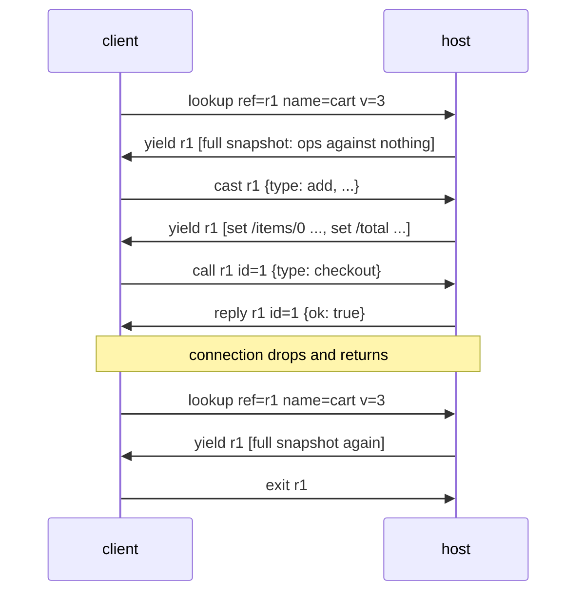

# The Nonchalant wire protocol (rev 3)

The protocol works over any ordered, reliable transport, including WebSocket,
BroadcastChannel, worker ports, and in-memory channels. It carries **plain-data
state patches rather than markup or code**. Any language can implement a host;
this file and the conformance vectors
(`packages/wire/spec/vectors/*.json`, format in `packages/wire/spec/README.md`)
are the contract. External hosts certify against the same vectors the reference
implementation runs in CI (`packages/wire/test/vectors.test.ts`).

## Messages

Client → host:

    { op: "lookup", ref, name, v, args? }  // get-or-spawn by schema name; v is 3; args are data
    { op: "cast",   ref, msg? }            // fire-and-forget
    { op: "call",   ref, id, msg? }        // correlated request
    { op: "exit",   ref }                  // release this watch; see Semantics for reclamation

Host → client:

    { op: "yield",  ref, patch }           // reconcile(prev, next) since the previous yield
    { op: "reply",  ref, id, value? }
    { op: "done",   ref, value? }          // normal completion
    { op: "raise",  ref, error }           // failure; see the error shape below

`ref` is a client-chosen opaque string. On shared-bus transports, clients make
refs globally unique (the reference implementation prefixes a per-session id).

`v` is the protocol revision the client speaks. A host answers a lookup whose
`v` is missing or is not `3` with a raise (see Errors) naming the revision it
speaks, so mismatched peers fail loudly on their first lookup.

An absent `msg` or `value` means "no value" (JavaScript's `undefined`); `null`
is a value and is always sent. A call whose handler replies with nothing still
gets a `reply`, one without a `value` field.

`id` is a safe integer (|id| ≤ 2^53 − 1), unique among the in-flight calls on
its ref; it may be reused once answered. Decoders drop a call or reply whose
`id` is not one.

## A session

```mermaid
sequenceDiagram
    participant C as client
    participant H as host
    C->>H: lookup ref=r1 name=cart v=3
    H->>C: yield r1 [full snapshot: ops against nothing]
    C->>H: cast r1 {type: add, ...}
    H->>C: yield r1 [set /items/0 ..., set /total ...]
    C->>H: call r1 id=1 {type: checkout}
    H->>C: reply r1 id=1 {ok: true}
    Note over C,H: connection drops and returns
    C->>H: lookup ref=r1 name=cart v=3
    H->>C: yield r1 [full snapshot again]
    C->>H: exit r1
```

## Patch grammar

    Patch = Op[]                        // applied in order
    Op = ["set",    path, value]
       | ["del",    path]
       | ["splice", path, start, remove, insert[]]

- `path` is an RFC 6901 JSON pointer: `""` is the root, `"/items/3/done"`
  descends; `~` and `/` inside keys are escaped as `~0` and `~1`. Hosts MUST
  reject malformed escapes (`~` followed by anything other than `0` or `1`).
- Every JSON key is valid, including `__proto__`, `constructor`, and
  `prototype`. Implementations MUST create own data properties without invoking
  prototype setters (the reference implementation uses `defineProperty`).
- The first `yield` after **any** lookup is a full snapshot: ops applied
  against an empty previous state. A lookup on a ref that is already being
  watched restarts the watch the same way. Reconnect is therefore not a
  special case: the client re-issues its lookups and receives full snapshots,
  which it diffs against whatever it kept.

## Errors

`error` is a Json value. Two conventions:

- **Call rejection**: when `error` is an object carrying a numeric `id`, the
  raise rejects exactly that pending call and nothing else. The host sends
  this when a call fails, is dropped by mailbox overflow, is refused by
  screening (see Semantics), or targets a ref that is not watched: before its
  lookup, after its `exit`, or after its `done` or process-level raise.
- **Process failure**: an `error` without an `id` means the process itself
  failed. Clients keep the last value (readers see `stale: true`) and reject
  all pending calls for the ref. No further yields arrive until a re-lookup.

The reference implementation emits `{ message, id? }`; hosts may add fields.
A lookup for a name outside the schema MUST answer with a process-level raise,
as MUST a lookup with the wrong `v`. A lookup a host refuses for resource
reasons (a per-session watch cap or lookup rate, for example) answers the same
way. The ref never becomes watched.

## Semantics

- `lookup` is get-or-spawn against the host's **published schema**. The schema
  is simultaneously the type contract and the security whitelist. Nothing
  outside it can be spawned remotely.
- `exit` releases the client's watch, not the process. Whether the process is
  then reclaimed is the host registry's business: the reference implementation
  disposes it once no watcher remains *and* its definition declares an idle
  timeout, so a definition without one stays resident until the host evicts it.
- `done` and a process-level raise are terminal for the ref: nothing further
  arrives for it, and a new lookup starts a new watch. In the reference
  registry that watch is on a fresh process, because an ended one is forgotten.
- One `reply` per `call` id; a crashed process rejects its pending calls
  rather than silently retrying.
- Screening: a host delivers a `msg` only if it is an object with a string
  `type`, the shape every process message has. A host may refuse more (the
  reference host runs the gateway's `admit`; see [Hosting safely](hosting.md)).
  A refused call raises with its id and a refused cast is dropped, so one
  client's malformed message never reaches a process other clients watch.
- A cast to a ref that is not watched is dropped silently, because
  fire-and-forget has nowhere to report.
- Casts arriving while a process is restarting are retained in a bounded
  mailbox and replayed; the overflow policy is drop-oldest (a dropped call
  is rejected).
- Ordering: per-ref FIFO both directions, with one exception: **replies are
  not ordered against yields.** A call's `reply` may arrive before the `yield`
  carrying the state change its handler made. The reference host sends a
  reply as soon as the handler calls `reply`, which is usually before its next
  yield. A client that needs the post-call state should have the call return
  it. There are no cross-ref ordering guarantees.
- Yields may be conflated: a host that observes state lossily (latest-value)
  sends patches between consecutive *observed* snapshots. Patches always
  compose; clients cannot tell the difference.
- A cast made while disconnected cannot reach the host. The reference client
  keeps the newest 64 per ref and sends them right after the reconnect
  re-lookup, so they reach the fresh watch in order. A call made while
  disconnected rejects at once, because a reply to it could not be told apart
  from one to a call that was never sent.
- Message size is a host limit rather than a protocol constant. The reference
  Node host accepts client messages up to 1 MiB by default and closes the
  connection with WebSocket code 1009 above that.

## Transports

A transport carries opaque strings, ordered and reliably, and reports
open/close. Two additional rules for shared buses (e.g. BroadcastChannel),
where every peer hears every message:

- Peers MUST ignore anything that does not decode as a message addressed to
  their side (the codec's direction filtering makes a bus safe).
- The literal string `nonchalant:announce` is not a message: a host posts it
  when it starts or restarts, and peers treat it as a transport `open`.
  Clients respond by re-issuing their lookups. This is how a replacement host
  picks up existing tabs.

The Node host (`@nonchalant/host`) additionally serves `GET /schema` over
HTTP: `{ "protocol": 3, "names": [...] }`, which exposes the whitelist for discovery.

The protocol does not define identity or grant access. A published schema only
limits process names; it does not prove who the client is or whether that
client may use particular lookup arguments and messages. The Node host can
reject WebSocket upgrades by browser origin, authenticate requests, and give
each connection a gateway that decides what it reaches and which messages it
may send, while application processes remain responsible for record- and
operation-level authorization. See [Hosting safely](hosting.md).
