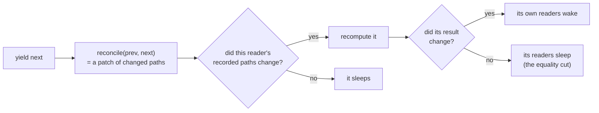
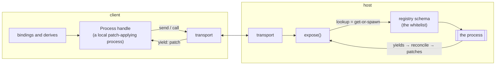

# Concepts

This reference describes each concept, its behavior, and the tests that enforce
that behavior.

## Process (from the outside)

Write a process as an async generator and run it with `spawn`. It returns
`Process<T, In>`, a handle to the instance that owns its mailbox,
its published snapshots, and its lifecycle. The handle is what you hold after
`spawn` or `lookup`:

| member | what it does |
|---|---|
| `p()` | Read the latest value synchronously. Inside a derive, effect, or view binding, this also subscribes by path. |
| `p.send(msg)` | Fire-and-forget message. Only exists if `In` has plain messages. |
| `p.ask(msg)` | Request/response, typed. Only exists if `In` has `Call` messages. Rejects if the process crashes, finishes, or is disposed. |
| `p.pending` | True while the process is working toward its next yield. |
| `p.stale` | True when the value survived a crash or a lost connection; clears on the next good yield. |
| `p.error` | The last failure, if any. |
| `for await (v of p)` | A live stream of values. Lossy on purpose: you always get the latest, never a backlog. |
| `p[Symbol.dispose]()` | Starts teardown immediately: closes the mailbox, aborts the signal, and requests generator return. Owned children are disposed after the generator settles. It does not wait for asynchronous `finally` work. |
| `await p[Symbol.asyncDispose]()` | Starts teardown and waits until this process and its owned-child finalizers have settled. |

Tests: `packages/core/test/process.test.ts`; the type rules are in
`types.check.ts`. Its `@ts-expect-error` assertions detect regressions if an
invalid operation starts compiling.

## Self (from the inside)

The generator receives `Self`. `for await (msg of self)` reads queued messages
in order. `self.latest()` drops older queued messages and returns the newest,
which is useful for typeahead input. `self.signal` is an AbortSignal triggered
by disposal or a crash, and `self.send` posts to the process's own mailbox.
`channel(signal?)` gives you a disposable standalone mailbox for middleware
and tests.

## spawn

`spawn(proc, args, opts?)`. Options:

- `initial`: the first readable value. With it, `p()` is `T`; without,
  `T | undefined` until the first yield.
- `restart: 'on-crash'`: rerun the generator from `args` after a throw, up to
  `maxRestarts` times. Queued messages replay; pending asks reject.
- `mailbox: n`: cap the queue; overflow drops the oldest and logs a warning.

Ownership: whatever a process spawns belongs to it and dies with it. The
attachment happens during the synchronous part of each step. Spawn before
you `await`, or the child ends up unowned. Registry processes are unowned
because shared state should not end with the caller that happened to start it.

Disposal is cooperative. The synchronous symbol establishes the teardown
point but cannot make an awaited promise settle. Use the async symbol when a
test, shutdown path, or resource handoff must know that finalizers have
finished. In either case, pass `self.signal` to long-running operations; if an
operation ignores abort and never settles, asynchronous disposal must wait for
it.

When a process returns, it has finished, and
its children are disposed with it. A view process that spawns page-local state
must therefore stay alive after its yield. It can wait on the mailbox
(`for await (const _ of self) void _`) and let whoever disposes you end the
wait. `examples/router/about.ts` shows the pattern.

## derive

`derive(fn)` creates a memoized computation with the full Process interface (readable,
iterable, disposable, `error`). It recomputes when something it read changes,
and notifies its readers only when its *result* changes. This equality check
prevents unchanged results from propagating through a chain of derivations.

## The graph (why updates are exact)

Every yield goes through the same pipeline: diff the new value against the old
(`reconcile`), keep the new snapshot, wake only the readers whose recorded
paths the diff touched.

The propagation engine is a faithful port of alien-signals
(`core/src/system.ts`). The path tracking sits on top: reads inside a tracked
context go through a short-lived read-only proxy that records which paths were
used, and the diff is matched
against that record.

State should be JSON-shaped: objects, arrays, and primitives. Other values such
as a `Date`, a `Map`, or a class instance are handled as
an *atomic leaf*: reads return it untouched and changes compare by identity,
so it works locally. There is no path tracking inside it, however, and only JSON
crosses a transport, so such values don't survive a remote `lookup`.

Effects run in a batch once per microtask; `flush()` runs them immediately.
Derives do not need either mechanism. Reading one always gives a consistent answer (the diamond
test proves no half-updated values are ever visible).

Tests: `graph.test.ts` (exact wake counts, glitch freedom), `reconcile.test.ts`
(property-based round-trips, minimal splices), `reconcile.perf.test.ts`
(1 change in 10k items diffs in ≤ 100 µs, enforced in CI), `process.test.ts`
("non-plain immutable values are tracked as atomic leaves").

## Views and sinks

A view is a function call producing plain data (`VNode`); a sink turns it into
something real. The DOM sink renders static structure once; each thunk or
process in the tree becomes a small live region with its own effect. Lists
reconcile by key within the list. Matching keys patch existing nodes,
`key: 0` is valid, identical vnodes are skipped entirely, and removals can wait for an `exit`
transition. A promise in a slot occupies only its own slot while pending;
a binding that throws keeps its previous content and reports the failure.
`onRenderError(handler)` routes those reports to your error reporting instead
of the console.

Strings are never parsed as markup, so HTML in application data remains inert
text. Tests also cover tables, SVG, and other common string-renderer
failure modes, in `packages/dom/test/dom.test.ts`.

CI limits these paths to one text write for one changed label in a
50-row list; one view yield and ≤ 3 DOM writes per frame for Mario
(`examples/mario/mario.golden.test.ts`).

## Registry

`registry(defs)` + `define(proc, opts)` + `lookup(name, args)`. Lookup is
get-or-spawn, keyed by name plus the arguments. Argument order is ignored, so `{a, b}`
and `{b, a}` are the same key). Subscribers to values or lifecycle metadata
count as watchers; plain reads don't. The idle timer starts at lookup and
restarts when the last watcher leaves; after eviction the next lookup starts
fresh. One mechanism, three jobs: dependency
injection, query caching, and remote addressing over a transport.
Tests: `registry.test.ts`.

## Wire

Eight JSON ops (`lookup/send/call/exit` from the client, `yield/reply/done/
raise` from the host), carrying state patches rather than markup or code.

`expose(reg, transport, opts?)` serves a registry or any object with a
`lookup` method, which is the seam per-connection scoping uses, and `opts`
carries `maxWatches` to cap how many refs one session may hold open.
`connect(transport)` gives you the same lookup interface backed by the other
side. Under the hood each remote process is a local process that applies
incoming patches. Remote reads therefore keep the same path-level precision as
local reads. A host crash appears as `stale: true`; reconnecting repeats the
lookup, receives the full state, and compares it with the retained value. The WebSocket transport redials automatically with exponential
backoff jittered to 50–100% of each step so a fleet of clients doesn't
stampede a restarting host; `retryDelay` tunes the base. A transport is only
`send` plus `subscribe`, so the port to a Web Worker is one as well:
`portTransport(new Worker(...))` here, `portTransport(workerEndpoint())` there,
and a heavy process is on another thread with the calling code unchanged
(`examples/worker`).

The format is documented for other languages in `packages/wire/spec/`. Its JSON
vectors define the contract and also run in this repository's CI.
`@nonchalant/host` puts it on real WebSockets; each connection is its own
session and cleans up after itself. This interface similarity does not erase
network constraints: wire values are JSON, requests can fail, and access must
be authorized at the host and inside application processes. See
[Hosting safely](hosting.md).

## What updates cost, measured

The structural diff is the heart of the write path, so its costs are worth
knowing (measured on Node v22.12, a 10k-item list of small objects; the
1-of-10k case is also the CI budget):

| situation | cost per yield | verdict |
|---|---|---|
| immutable update, 1 of 10,000 items changed | ~46 µs | within the repository's frame budget |
| immutable append to 10,000 | ~38 µs | similar cost |
| immutable update, 1 of 100,000 | ~760 µs | reasonable for occasional interaction; measure frame loops |
| zero structural sharing, 10,000 items (mutate-and-clone) | ~4,900 µs | reuse unchanged objects to avoid this case |
| small state (a form, a game HUD), even with zero sharing | ~4 µs | unlikely to be the bottleneck |

The practical guidance is to reuse unchanged objects and keep frame-rate
snapshots small. These figures describe one benchmark environment, so measure
your own data shapes when the write path is performance-sensitive.

## The budgets, in one place

| budget | enforced in |
|---|---|
| reconcile: 1 change in 10k ≤ 100 µs | `reconcile.perf.test.ts` |
| Mario: 1 view yield, ≤ 3 DOM writes/frame, 0 node churn | `mario.golden.test.ts` |
| bundle sizes: core ≤ 8 KB gzip, app ≤ 13 KB, wire ≤ 9.5 KB | `test/size.test.ts` |
| nothing retained after dispose | `process.leaks.test.ts` |
