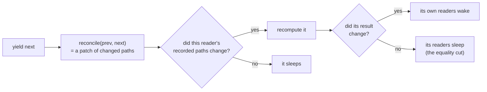
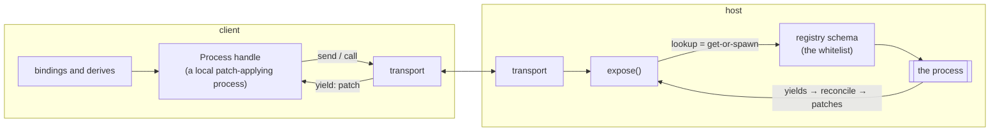

# Concepts

The reference. For each concept: what it promises, and where the test lives
that holds it to the promise.

## Process (from the outside)

You *write* a process as an async generator; `spawn` *runs* it and returns
`Process<T, In>` — a handle to the running instance that owns its mailbox,
its published snapshots, and its lifecycle. The handle is what you hold after
`spawn` or `lookup`:

| member | what it does |
|---|---|
| `p()` | Read the latest value, synchronously. Inside a derive, effect, or view binding this also subscribes (by path); anywhere else it's just a read. |
| `p.send(msg)` | Fire-and-forget message. Only exists if `In` has plain messages. |
| `p.ask(msg)` | Request/response, typed. Only exists if `In` has `Call` messages. Rejects if the process crashes, finishes, or is disposed. |
| `p.pending` | True while the process is working toward its next yield. |
| `p.stale` | True when the value survived a crash or a lost connection; clears on the next good yield. |
| `p.error` | The last failure, if any. |
| `for await (v of p)` | A live stream of values. Lossy on purpose: you always get the latest, never a backlog. |
| `p[Symbol.dispose]()` | Ends the process. The mailbox closes, `finally` blocks run, then anything it spawned dies too — in that order. |

Tests: `packages/core/test/process.test.ts`; the type rules are in
`types.check.ts`, where the `@ts-expect-error` lines are the point — if one
stops erroring, the types regressed.

## Self (from the inside)

What the generator receives: `for await (msg of self)` reads the mailbox in
order (messages queue while you're busy — backpressure by default);
`self.latest()` skips to the newest message and drops the rest (what a
typeahead wants); `self.signal` is an AbortSignal that fires on dispose or
crash — pass it to your fetches; `self.send` posts to your own mailbox.
`channel(signal?)` gives you a standalone mailbox for middleware and tests.

## spawn

`spawn(proc, args, opts?)`. Options:

- `initial` — the first readable value. With it, `p()` is `T`; without,
  `T | undefined` until the first yield.
- `restart: 'on-crash'` — rerun the generator from `args` after a throw, up to
  `maxRestarts` times. Queued messages replay; pending asks reject.
- `mailbox: n` — cap the queue; overflow drops the oldest (and warns).

Ownership: whatever a process spawns belongs to it and dies with it. The
attachment happens during the synchronous part of each step — spawn before
you `await`, or the child ends up unowned. Registry processes are deliberately
unowned: shared state shouldn't die with whichever caller happened to start it.

One consequence worth internalizing: **a process that returns is over**, and
its children are disposed with it. A view process that spawns page-local state
must therefore stay alive after its yield — idle on the mailbox
(`for await (const _ of self) void _`) and let whoever disposes you end the
wait. `examples/router/about.ts` shows the pattern.

## derive

`derive(fn)` — a memoised computation with the full Process face (readable,
iterable, disposable, `error`). It recomputes when something it read changes,
and tells its own readers only if its *result* changed. That last part — the
equality cut — is what keeps chains of derivations quiet.

## The graph (why updates are exact)

Every yield goes through the same pipeline: diff the new value against the old
(`reconcile`), keep the new snapshot, wake only the readers whose recorded
paths the diff touched.

The propagation engine is a faithful port of alien-signals
(`core/src/system.ts`). The path tracking sits on top: reads inside a tracked
context go through a short-lived read-only proxy that records what was looked
at — a number read here, a list iterated there — and the diff is matched
against that record.

Effects run in a batch once per microtask; `flush()` runs them now. Derives
don't need either — reading one always gives a consistent answer (the diamond
test proves no half-updated values are ever visible).

Tests: `graph.test.ts` (exact wake counts, glitch freedom), `reconcile.test.ts`
(property-based round-trips, minimal splices), `reconcile.perf.test.ts`
(1 change in 10k items diffs in ≤ 100 µs — a CI assertion).

## Views and sinks

A view is a function call producing plain data (`VNode`); a sink turns it into
something real. The DOM sink renders static structure once; each thunk or
process in the tree becomes a small live region with its own effect. Lists
reconcile by key — that's the one diff this library keeps, it's local to the
list, and it's honest about it: same key patches in place, `key: 0` counts,
identical vnodes are skipped entirely, removals can wait for an `exit`
transition. A promise in a slot occupies only its own slot while pending;
a binding that throws keeps its previous content and logs.

Strings are never parsed as markup, so injected HTML in your data is inert
text — asserted, along with tables, SVG, and the other classic string-renderer
failure modes, in `packages/dom/test/dom.test.ts`.

The headline numbers are CI budgets: one text write for one changed label in a
50-row list; one view yield and ≤ 3 DOM writes per frame for Mario
(`examples/mario/mario.golden.test.ts`).

## Registry

`registry(defs)` + `define(proc, opts)` + `lookup(name, args)`. Lookup is
get-or-spawn, keyed by name plus the arguments (order-independent — `{a, b}`
and `{b, a}` are the same key). Subscribers count as watchers; plain reads
don't. When the last watcher leaves, an `evict` timer (if configured) disposes
the entry; the next lookup starts fresh. One mechanism, three jobs: dependency
injection, query cache, and — over the wire — remote addressing.
Tests: `registry.test.ts`.

## Wire

Eight JSON ops (`lookup/send/call/exit` from the client, `yield/reply/done/
raise` from the host), carrying state patches — never markup, never code.

`expose(reg, transport)` serves a registry; `connect(transport)` gives you the
same registry interface backed by the other side. Under the hood each remote
process is a local process that applies incoming patches, which is why remote
reads are just as fine-grained as local ones, a crash on the host shows up as
`stale: true` here, and reconnecting is nothing special: look the name up
again, get the full state, diff it against what you kept.

The format is documented for other languages in `packages/wire/spec/` — the
JSON vectors there are the contract, and this repo's CI runs them too.
`@nonchalant/host` puts it on real WebSockets; each connection is its own
session and cleans up after itself.

## What updates cost, measured

The structural diff is the heart of the write path, so its costs are worth
knowing (measured on Node v22.12, a 10k-item list of small objects; the
1-of-10k case is also the CI budget):

| situation | cost per yield | verdict |
|---|---|---|
| immutable update, 1 of 10,000 items changed | ~46 µs | free at interaction rate; fine at 60 fps |
| immutable append to 10,000 | ~38 µs | same |
| immutable update, 1 of 100,000 | ~760 µs | fine per keystroke; not per frame |
| zero structural sharing, 10,000 items (mutate-and-clone) | ~4,900 µs | the pathology — spread what changed, reuse the rest |
| small state (a form, a game HUD), even with zero sharing | ~4 µs | never matters |

The guidance that falls out: yields at interaction rate are always fine;
yields at frame rate want frame-sized state — which is what per-frame state
looks like anyway (the golden demo's world is five numbers).

## The budgets, in one place

| budget | enforced in |
|---|---|
| reconcile: 1 change in 10k ≤ 100 µs | `reconcile.perf.test.ts` |
| Mario: 1 view yield, ≤ 3 DOM writes/frame, 0 node churn | `mario.golden.test.ts` |
| bundle sizes: core ≤ 8 KB gzip, app ≤ 13 KB, wire ≤ 9.5 KB | `test/size.test.ts` |
| nothing retained after dispose | `process.leaks.test.ts` |
