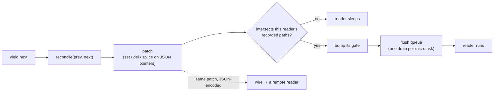
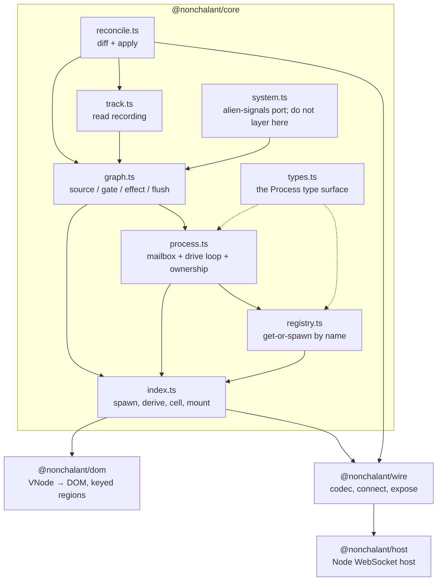

# Internals

These notes explain the core implementation. For the public contract, read
[concepts.md](../concepts.md). This section covers internal mechanisms,
invariants, and changes that can break them.

| doc | module | what it covers |
|---|---|---|
| [reconcile.md](reconcile.md) | `reconcile.ts` | the structural diff, the op vocabulary, array splices |
| [tracking.md](tracking.md) | `track.ts` | recording proxies, path trees, patch intersection |
| [graph.md](graph.md) | `graph.ts` + `system.ts` | sources, gates, mid-run publishes, scheduling |
| [process.md](process.md) | `process.ts` | mailbox, drive loop, ownership, dispose ordering |
| [registry.md](registry.md) | `registry.ts` | key encoding, sharing, refcounting, eviction |

## One update path

The whole library is one pipeline with adapters on either end. Everything
downstream of a yield is the same code whether the state lives in this tab or
on a server:

Keep two consequences in mind when changing this code:

- **The diff is the contract.** The patch a local binding reacts to is the
  patch that crosses the socket. `packages/wire/spec/` certifies external hosts
  against those op shapes, so a change to the op vocabulary is a protocol
  change, not an implementation detail.
- **Precision is a property of reads, not writes.** Application code writes
  immutable updates and never declares dependencies. Everything
  fine-grained comes from the reader side recording what it touched.

## Module map

Read bottom-up on first contact: `reconcile` → `track` → `graph` → `process` →
`registry`. Each layer only knows about the ones below it.

## Layering rules

These are the constraints that keep the design coherent; `CLAUDE.md` carries
the full list.

- **`system.ts` stays 1:1 with upstream alien-signals.** It is a faithful MIT
  port, attributed in `THIRD-PARTY-NOTICES.md`. Path precision is layered in
  `graph.ts` via gates precisely so the port never needs editing. Changes go in
  `graph.ts`.
- **`packages/core` never touches the DOM**, and `packages/wire` stays
  isomorphic and DOM-free (host-universal globals reached through `globalThis`
  are fine).
- **Budgets are CI assertions.** Tighten them when you can; never loosen one to
  make a change fit.
- **New public concepts must dissolve at least two existing problems.** The
  registry earned its place by being DI, query cache, and remote addressing at
  once. Otherwise it belongs in [recipes.md](../recipes.md) as userland code.

## Where to look when something breaks

| symptom | start here |
|---|---|
| a reader wakes too often, or not at all | [tracking.md](tracking.md) for precision rules, then `affects` |
| a reader misses an update that landed mid-run | [graph.md](graph.md) for deferred operations and `finalizeGates` |
| a patch is wrong, or an apply throws | [reconcile.md](reconcile.md) for array trimming and path escaping |
| a process outlives its parent, or dies early | [process.md](process.md) for the ambient ownership window |
| shared state respawns or lingers | [registry.md](registry.md) for watcher counting and the idle timer |
| effects run in the wrong order or too late | [graph.md](graph.md) for scheduling and `flush` |
| a remote handle behaves unlike a local one | `wire/client.ts`; each remote ref is a local pump process |

## Budgets

Every performance or granularity claim in the docs points at the test that
enforces it:

| budget | enforced in |
|---|---|
| reconcile: 1 change in 10k ≤ 100 µs | `packages/core/test/reconcile.perf.test.ts` |
| Mario: 1 view yield, ≤ 3 DOM writes/frame, 0 structural ops | `examples/mario/mario.golden.test.ts` |
| bundle sizes: core ≤ 8 KB gzip, app ≤ 13 KB, wire ≤ 9.5 KB | `test/size.test.ts` |
| nothing retained after dispose | `packages/core/test/process.leaks.test.ts` |

## Test environment notes

Two environment quirks that cause confusing false failures:

- Leak tests need `gc({ execution: 'async' })`. Plain `gc()` false-fails under
  V8 conservative stack scanning.
- happy-dom's `MutationObserver` misses `characterData`, so DOM-write tests spy
  on `Text#data` and `setAttribute` instead of observing mutations.
