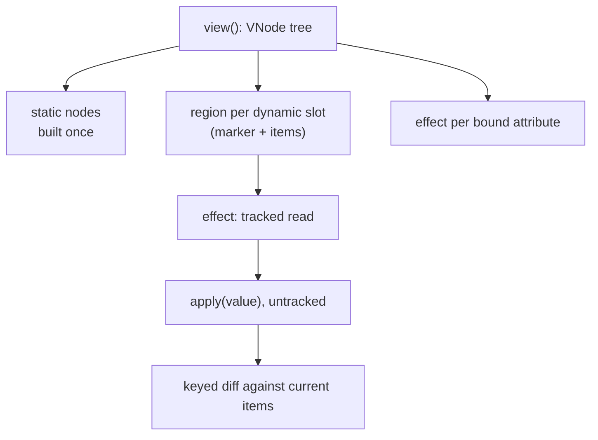

# render.ts: the DOM sink

`packages/dom/src/render.ts`. Imports `effect` and `untracked` from core and
nothing else. It turns `VNode` trees (plain data) into DOM nodes with
`createElement`, `createTextNode`, and `setAttribute`, and keeps them current.
No string is ever parsed as markup.

## Static structure and regions

A view function runs once. Its static structure (elements, text, attributes
with plain values) is built once and never revisited. Everything dynamic is a
*region*:

- a thunk or process in a child position,
- a promise or async iterable in a child position,
- the root passed to `mount`.

A region is anchored by an empty comment node (its marker) and owns the items
rendered before that marker. A thunk or process region is driven by one
`effect`: the effect's tracked read decides when it wakes, and `region.apply`
runs `untracked`, so bindings inside the items it builds are independent
effects owned by those items, not by the region. A region re-run therefore
never tears down the bindings of the items it keeps.

A function in an attribute position (other than `on*`) is a binding: one
`effect` per attribute, stored in the element's `fx` map by name.

## Reconciling a region

`apply` flattens the new value to strings and vnodes, then matches each
against the current items:

- Keyed vnodes match by key (`key: 0` is a key: presence, not truthiness);
  unkeyed ones and text match positionally among items of the same kind.
- A match with the same tag is patched in place (`patchElement`). A
  reference-equal vnode is skipped without looking inside. A tag change, or an
  explicit `ns` change, builds a new element.
- Items left unmatched are removed (see [Exit](#exit)).

**Moves.** Each surviving item records its old position. `keepers(from)` marks
one longest strictly increasing subsequence of those positions; those nodes are
already in relative order and stay. Every other node is inserted before the
next node from the end, so a reorder costs n − LIS moves for n survivors, the
minimum. When the parent has `moveBefore` and is connected, moves use it, which
keeps focus, selection, and running animations; otherwise `insertBefore`.
Enforced by `packages/dom/test/keyed.property.test.ts` (moves = survivors −
LIS over random permutations) and the swap and move-to-front cases in
`examples/js-framework-benchmark/bench.test.ts` (2 moves and 1 move of 1,000
rows).

**Clear.** When the new value is empty and no item has an `exit` hook, the
region disposes every item and, if it is its parent's whole content, replaces
the parent's children with just its marker in one `replaceChildren` call
instead of one removal per item. The "bulk clear" tests in `render.test.ts` and
the clear case in `bench.test.ts` cover both paths.

## Patching an element

`patchElement` diffs attributes, then children, then the property attributes:

1. Attributes other than `value`, `checked`, and `selected`: names gone from
   the new vnode are removed; names whose value is a different reference are
   re-applied; the same reference (the same binding function included) is left
   alone.
2. Children, position by position (`patchChildren`). A text child whose string
   is unchanged writes nothing. A hole whose old and new slots are both
   functions is **rebound**: the old effect stops and a new one drives the same
   region, which diffs against its current items and keeps its DOM.
3. `value`, `checked`, and `selected`, set as properties. They come last
   because a `<select>`'s value can only match options that already exist.

**Rebinding without churn.** A bound attribute replaced by another binding
stops the old effect and starts the new one directly; the attribute never
passes through `null`, so the new effect's first value lands over the old one.
Combined with no-op skipping, a keyed row re-rendered with fresh closures
writes nothing and re-adds no listener (`render.test.ts`, "fresh closures
rebind in place").

**No-op writes are skipped.** `setAttrValue` compares with `getAttribute` (or
the property, for `value`/`checked`/`selected`) before writing, and removes
only attributes that are present. A binding that re-runs to the value already
in the DOM costs a read.

## Listeners

One module-level function, `dispatch`, is the only listener the sink ever adds.
The first `on<type>` handler on an element adds `dispatch` for that event type;
the handler itself goes in a `WeakMap<Element, Record<type, handler>>`.
`dispatch` looks up the current handler for `this` and `e.type` and calls it.

So swapping a handler (every re-render with a fresh arrow function) is a map
write, not a `removeEventListener`/`addEventListener` pair, and disposing an
element is deleting its map entry; a listener still attached then finds
nothing. There is no delegation to a root: each element listens for its own
events, so `stopPropagation` and non-bubbling events behave as the platform
defines them.

A non-function `on*` value clears the handler and warns; a string is never
compiled into script. Event names are used verbatim after `on`, so `onClick`
listens for `Click` (the sink warns once; the attribute types reject it).

## Attribute policy

`setAttrValue` removes a `javascript:` URL from `href`, `src`, `action`,
`formaction`, and `xlink:href`, testing the scheme after stripping
U+0000–U+0020 as browsers do. `aria-*` booleans render as `"true"`/`"false"`.
An object value warns once (it would stringify to `[object Object]`). Warnings
go through `lint`, which prints each distinct message once, not once per row.

## Exit

Removing an item disposes its bindings and listeners first. If its vnode has
an `exit` hook, the element gets `inert` (out of the focus order and the
accessibility tree), the hook is called with it, and the element is removed
when the hook's result settles, whether it resolves or rejects. A hook that
throws synchronously is reported and the element is removed at once. When any
current item has an `exit` hook, a clear takes the per-item path so that hook
still runs.

## Errors

A binding that throws, a rejected slot promise, or a failing slot iterable is
reported through `onRenderError` (default `console.error`) and its region keeps
its previous content. Nothing above the region re-renders and nothing below it
unmounts.

## Invariants to keep

- Construction is a patch from an empty element of the same tag
  (`renderElement` calls `patchElement`), so creation and update cannot
  disagree about attribute order or property timing.
- `region.apply` runs untracked. Tracking there would make a region's effect
  depend on everything its items read.
- Moves only touch nodes outside the kept subsequence; inserting a kept node
  would still be correct but would break the move-count tests.
- `handlers.delete(el)` on dispose is what makes a disposed element's listener
  do nothing. Without it, an element kept alive by an exit animation would
  still call the handlers of the view that removed it.
