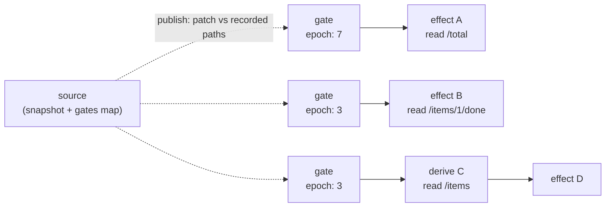
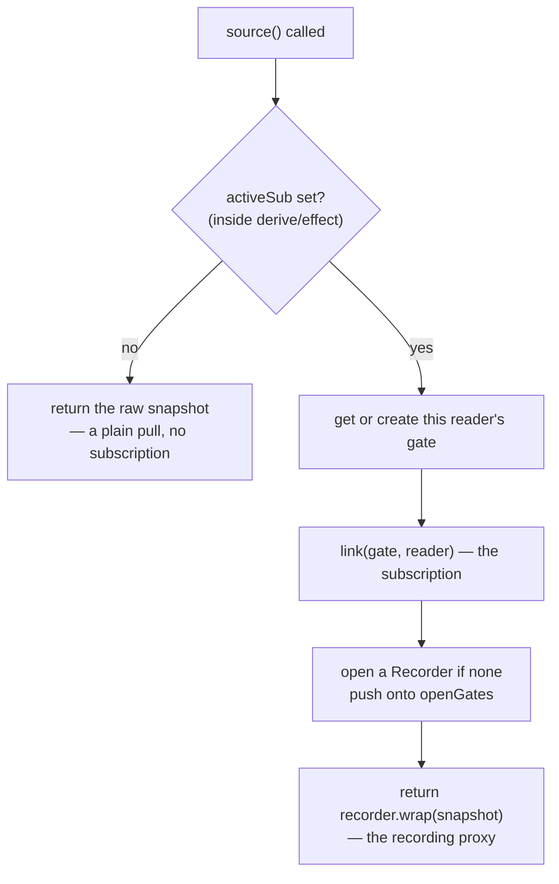
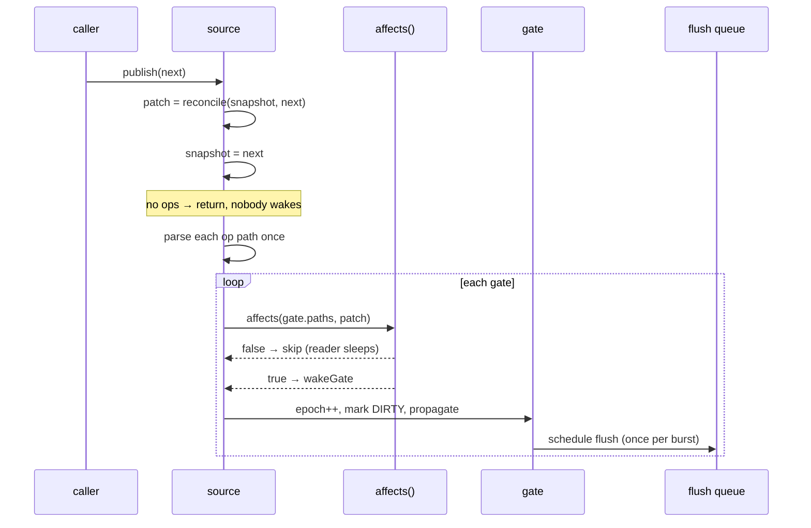
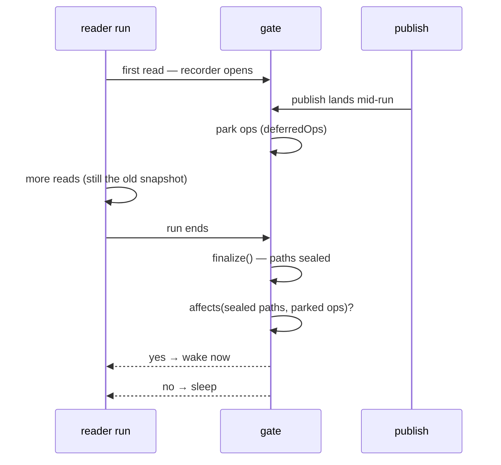

# graph.ts — sources, gates, and scheduling

`packages/core/src/graph.ts`, sitting on `system.ts`, `reconcile.ts`, and
`track.ts`. This is where path precision becomes actual subscriptions.

Two layers, deliberately separated:

- **`system.ts`** is a faithful port of [alien-signals](https://github.com/stackblitz/alien-signals)
  (MIT, Johnson Chu): intrusive doubly-linked dependency lists, integer
  bitflags, no recursion, no `Array`/`Set`/`Map` in the hot path. It knows
  nothing about paths, patches, or processes. **Keep it 1:1 with upstream** —
  layer changes belong in `graph.ts`.
- **`graph.ts`** adds the thing alien-signals has no notion of: `source`, a
  state root that wakes readers *per path*.

## The gate mechanism

A signal wakes all its readers. A `source` must wake only the readers whose
recorded paths a patch touched — but without teaching the ported propagation
core about paths.

The trick is indirection: each **(source, reader) pair** gets a hidden **gate**
— an ordinary signal node whose value is a change epoch (an integer). The
reader subscribes to the gate, never to the source. `publish()` decides which
gates to bump; everything after that is stock alien-signals propagation, with
its equality cuts intact.

A publish of `['set', '/total', 9]` bumps only gate 1. Effects B and D are
never notified, never re-run, and never even compared — the propagation core
does not see them as dirty, because their gates did not change.

Gate bookkeeping:

- **Created lazily** on first tracked read, keyed by the reading node
  (`state.gates: Map<ReactiveNode, Gate>`).
- **Removed** through the reactive system's `unwatched` callback when the
  reader drops the dependency, which also drives the watcher count that the
  registry uses for refcounting (see [registry.md](registry.md)).
- **One per pair**, so a reader that reads two sources has two gates, and two
  readers of one source never share.

## Read path

`source()` returns a callable. What a read does depends on whether a reader is
currently running (`activeSub`):

That top branch is the "reads outside tracked contexts are snapshots" rule
from the style guide, and it is one `if`. Nothing subscribes by accident; a
read subscribes exactly when it happens inside a body the graph is running.

## Write path

Note the ordering: the snapshot is assigned *before* any reader wakes, so a
woken reader always observes the new state. And an empty patch returns early —
publishing a value that diffs to nothing wakes nobody, which is what makes
"yield the same shape again" cheap.

## The mid-run publish problem

This is the subtlest part of the module, and the reason `Gate` carries
`deferredOps`.

A reader's dependency set is not known until its run finishes. If a publish
lands *while* a reader is running, the question "did this reader read a path
this patch touched?" has no answer yet — reads still to come in that run will
see the pre-publish snapshot through the already-open recorder, and any of them
might touch the changed path.

Deciding early is wrong in both directions: skip it and a reader that reads the
changed path a line later misses the update; wake it and readers that never
touch it re-run for nothing.

So the decision is deferred. A publish arriving while a gate's recorder is open
parks its ops on the gate. When the run ends, `finalizeGates` seals the freshly
recorded paths and *then* judges the parked ops against them:

`openGates` is a stack and `finalizeGates(mark)` pops down to a mark, so nested
runs (an effect inside an effect, a derive read by a derive) finalize only
their own recordings. Every path that runs a reader body — `updateComputed`,
the cold-read branch of `computedOper`, `effect`, and `run` — takes a mark
before and finalizes in a `finally`.

Callers clear `RECURSED_CHECK` before finalizing so a wake raised from
`finalizeGates` notifies normally rather than being swallowed as re-entrancy.
`requeueIfDirtied` catches the remaining case: an inner publish that reached a
running effect *through a computed* sets `PENDING` without queueing, and is
picked up once the run is over.

The four "publishes during a reader run" tests in `graph.test.ts` are the
regression suite for all of this — including the one that matters most, "a
path read only after the mid-run publish still wakes the reader".

## Scheduling

Upstream alien-signals flushes synchronously on write. Here, writes never do:

- `scheduleFlush()` schedules one drain per burst on the microtask queue, via
  `Promise.resolve().then(...)` rather than `queueMicrotask` — pure ES, keeping
  core free of host-specific globals.
- `flush()` is exported for a synchronous drain (what tests and the DOM golden
  budgets use).
- Wakes raised *during* a flush are drained by the running loop; no extra
  microtask is scheduled.
- One effect throwing must not strand the effects queued behind it: `flush`
  catches per effect, runs them all, and rethrows the first error afterwards.

Derives (computeds) are pull-based and unaffected by flush timing — reading one
always returns a consistent value, whether or not effects have run. That is the
glitch-freedom guarantee; the diamond test in `graph.test.ts` holds it.

## Local flags

`HAS_CHILD_EFFECT = 64` marks a parent whose deps include an owned child
effect, gating the dispose-children slow path. It lives outside the flag range
`system.ts` defines (which stops at `PENDING = 32`) — the upstream trick for
extending the bitfield without editing the ported core.

Effects created inside a running reader are *owned* by it: linked to the parent
and disposed when the parent re-runs (`pruneChildEffects`) or is disposed.
Child-effect deps are ownership edges, not read edges, which is why they are
detached before a re-run rather than purged as unread dependencies.

## Where to be careful

- Anything that changes when a reader body runs must take an `openGates` mark
  and finalize in a `finally`, or gates leak recorders and stop waking.
- `publish` assigns the snapshot before waking. Don't reorder it.
- Adding a fast path to `affects` is fine; teaching `system.ts` about paths is
  not — that is the layering rule the port depends on.

Next: [process.md](process.md) — how a generator becomes a source with a
mailbox and a lifetime.
