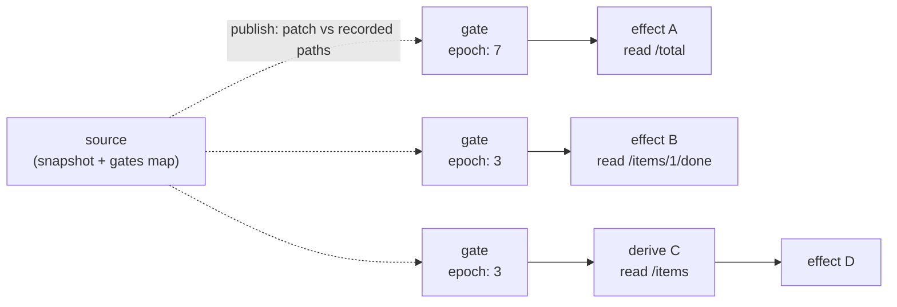
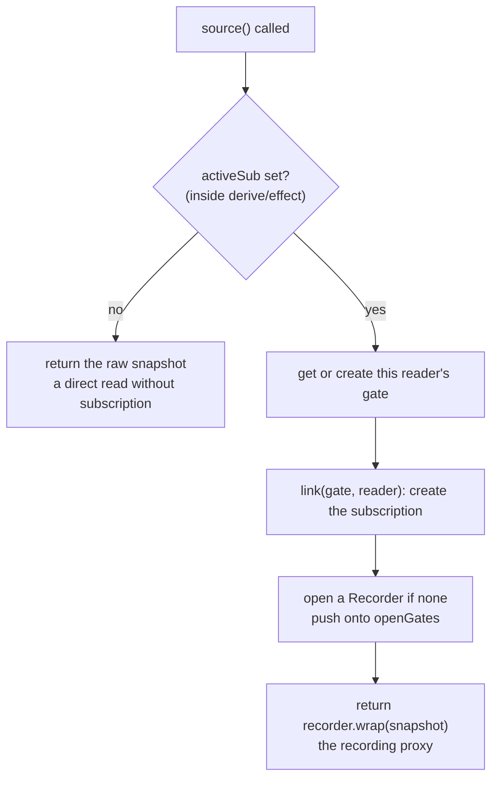
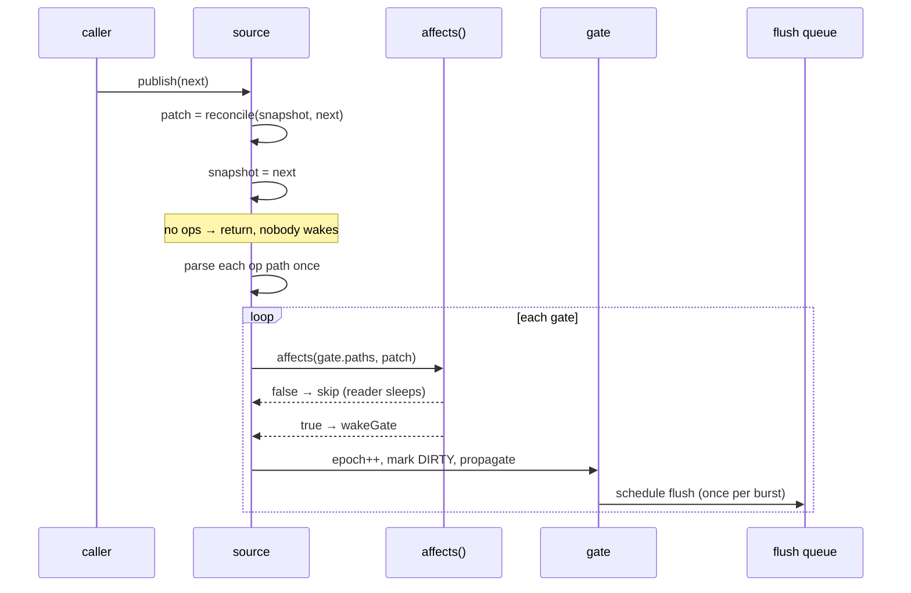

# graph.ts: sources, gates, and scheduling

`packages/core/src/graph.ts`, sitting on `system.ts`, `reconcile.ts`, and
`track.ts`. This is where path precision becomes actual subscriptions.

| file | holds |
|---|---|
| `graph.ts` | sources and their gates, computeds, effects and bindings: everything that shares the running reader (`activeSub`) |
| `watch.ts` | watched-ness: `isWatched`, `rewatch`, and the per-source watcher `count` |
| `queue.ts` | the effect queue: `enqueue` (the system's `notify`), `schedule`, `drain` |

`watch.ts` and `queue.ts` touch no graph state, so their tests
(`watch.test.ts`, `queue.test.ts`) drive them over hand-built nodes.

The graph has two separate layers:

- **`system.ts`** is a faithful port of [alien-signals](https://github.com/stackblitz/alien-signals)
  (MIT, Johnson Chu): intrusive doubly-linked dependency lists, integer
  bitflags, no recursion, no `Array`/`Set`/`Map` in the hot path. It knows
  nothing about paths, patches, or processes. **Keep it 1:1 with upstream**;
  layer changes belong in `graph.ts`.
- **`graph.ts`** adds the thing alien-signals has no notion of: `source`, a
  state root that wakes readers *per path*.

## The gate mechanism

A signal wakes all its readers. A `source` must wake only readers whose recorded
paths a patch touched, without adding path awareness to the ported propagation
core.

The trick is indirection: each **(source, reader) pair** gets a hidden **gate**
implemented as a signal node whose value is a change epoch (an integer). The
reader subscribes to the gate, never to the source. `publish()` decides which
gates to bump; everything after that is stock alien-signals propagation, with
its equality cuts intact.

```mermaid
flowchart LR
    SRC["source<br/>(snapshot + gates map)"]
    SRC -.->|"publish: patch vs recorded paths"| G1
    SRC -.-> G2
    SRC -.-> G3
    G1["gate<br/>epoch: 7"] --> R1["effect A<br/>read /total"]
    G2["gate<br/>epoch: 3"] --> R2["effect B<br/>read /items/1/done"]
    G3["gate<br/>epoch: 3"] --> R3["derive C<br/>read /items"]
    R3 --> R4["effect D"]
```

A publish of `['set', '/total', 9]` bumps only gate 1. Effects B and D are
is not notified, rerun, or compared. The propagation core
does not see them as dirty, because their gates did not change.

Gate bookkeeping:

- **Created lazily** on first tracked read, keyed by the reading node
  (`state.gates: Map<ReactiveNode, Gate>`).
- **Removed** through the reactive system's `unwatched` callback when the
  reader drops the dependency.
- **Counted** as a watcher only while its reader is *watched*: the reader is
  an effect, or a computed with an effect somewhere downstream. The count is
  what `onWatchers` reports, and the registry refcounts with it (see
  [registry.md](registry.md)). alien-signals keeps a computed's deps linked
  until its last subscriber leaves, so a derive read once outside any effect
  stays linked to its gates indefinitely. Counting links would let that
  snapshot read pin a registry entry forever.

The watched bit is not stored. `isWatched(node)` (`watch.ts`) walks
subscribers up to an effect, which is usually one hop. Each walk stamps the
computeds it reaches (`seen`, one epoch per query), so a node is visited at
most once per query: on a DAG of computeds the walk is O(nodes + links), not
O(paths), which a diamond chain makes exponential. `rewatch` stamps the same
way (`swept`). `watch.test.ts` builds a 30-level diamond (2^30 paths) from
nodes whose stamps are counting accessors and asserts exactly one visit per
node for a query and one sweep per node for `rewatch`; `graph.scale.test.ts`
runs the same diamond through real computeds to exact recompute counts. It is
re-judged only at the transitions, all of them raised by `graph.ts`:

- a gate is created: counted if its reader is watched;
- `computedOper` links a computed that was not watched under a watched
  reader: `rewatch(c, true)` counts every gate beneath it;
- a dependency link is removed (`purgeDeps`, `disposeAllDepsInReverse`) from
  a computed that still has other subscribers: if none of them is watched,
  `rewatch(dep, false)` uncounts the gates beneath it;
- a gate loses its reader (`unwatched`): uncounted if it was counted.

`graph.test.ts` "source watchers count only readers an effect depends on"
pins each transition with exact `onWatchers` sequences.
- **One per pair**, so a reader that reads two sources has two gates, and two
  readers of one source never share.

## Read path

`source()` returns a callable. What a read does depends on whether a reader is
currently running (`activeSub`):

```mermaid
flowchart TD
    R["source() called"] --> A{"activeSub set?<br/>(inside derive/effect)"}
    A -->|no| RAW["return the raw snapshot<br/>a direct read without subscription"]
    A -->|yes| G["get or create this reader's gate"]
    G --> L["link(gate, reader): create the subscription"]
    L --> REC["open a Recorder if none<br/>push onto openGates"]
    REC --> P["return recorder.wrap(snapshot)<br/>the recording proxy"]
```

That top branch is the "reads outside tracked contexts are snapshots" rule
from the style guide, and it is one `if`. Nothing subscribes by accident; a
read subscribes exactly when it happens inside a body the graph is running.

## Write path

```mermaid
sequenceDiagram
    participant C as caller
    participant S as source
    participant T as affects()
    participant G as gate
    participant Q as flush queue

    C->>S: publish(next)
    S->>S: patch = reconcile(snapshot, next)
    S->>S: snapshot = next
    Note over S: no ops → return, nobody wakes
    S->>S: parse each op path once
    loop each gate
        S->>T: affects(gate.paths, patch)
        T-->>S: false → skip (reader sleeps)
        T-->>S: true → wakeGate
        S->>G: epoch++, mark DIRTY, propagate
        G->>Q: schedule flush (once per burst)
    end
```

Note the ordering: the snapshot is assigned *before* any reader wakes, so a
woken reader always observes the new state. An empty patch returns early, so
publishing a value that diffs to nothing wakes nobody, which is what makes
"yield the same shape again" cheap.

## The mid-run publish problem

This is the most subtle part of the module and explains why `Gate` carries
`deferred`.

A reader's dependency set is not known until its run finishes. If a publish
lands *while* a reader is running, the question "did this reader read a path
this patch touched?" does not yet have an answer because later reads in that run will
see the pre-publish snapshot through the already-open recorder, and any of them
might touch the changed path.

Deciding early is wrong in both directions: skip it and a reader that reads the
changed path a line later misses the update; wake it and readers that never
touch it re-run for nothing.

So the decision is deferred. A publish arriving while a gate's recorder is open
parks its ops on the gate. When the run ends, `finalizeGates` seals the freshly
recorded paths and *then* judges the parked ops against them. Parked ops keep
only their pointers, so `affects` parses them again there: the price of the
rare path, paid instead of carrying pre-parsed segments on every gate.

```mermaid
sequenceDiagram
    participant E as reader run
    participant G as gate
    participant P as publish

    E->>G: first read; recorder opens
    P->>G: publish lands mid-run
    G->>G: park ops (deferred)
    E->>E: more reads (still the old snapshot)
    E->>G: run ends
    G->>G: finalize(); paths sealed
    G->>G: affects(sealed paths, parked ops)?
    G-->>E: yes → wake now
    G-->>E: no → sleep
```

`openGates` is a stack and `finalizeGates(mark)` pops down to a mark, so nested
runs (an effect inside an effect, a derive read by a derive) finalize only
their own recordings. Every path that runs a reader body takes a mark before
and finalizes in a `finally`: `updateComputed`, the cold-read branch of
`computedOper`, and `runBody`, which both an effect's first run (`start`) and
its re-runs (`run`) go through.

Callers clear `RECURSED_CHECK` before finalizing so a wake raised from
`finalizeGates` notifies normally rather than being swallowed as re-entrancy.
`requeueIfDirtied` catches the remaining case: an inner publish that reached a
running effect *through a computed* sets `PENDING` without queueing, and is
picked up once the run is over.

The four "publishes during a reader run" tests in `graph.test.ts` are the
regression suite for all of this, including "a
path read only after the mid-run publish still wakes the reader".

## Scheduling

Upstream alien-signals flushes synchronously on write. Here, writes never do.
The queue lives in `queue.ts`, and takes the effect runner as an argument so
it knows nothing of what an effect is:

- `schedule(run)` asks for one drain per burst on the microtask queue, via
  `Promise.resolve().then(...)` rather than `queueMicrotask`, keeping the code
  core free of host-specific globals.
- `flush()` (graph.ts, `drain(run)`) is exported for a synchronous drain
  (what tests and the DOM golden budgets use).
- Wakes raised *during* a drain are run by the running loop; no extra
  microtask is scheduled.
- One effect throwing must not strand the effects queued behind it: `drain`
  catches per effect, runs them all, and rethrows the first error afterwards.

`queue.test.ts` pins each of these, and the parents-first order below, over
fake effect nodes.

Derives (computeds) are pull-based and unaffected by flush timing. Reading one
always returns a consistent value, whether or not effects have run. That is the
glitch-freedom guarantee; the diamond test in `graph.test.ts` holds it.

## Local flags

`HAS_CHILD_EFFECT = 64` marks a parent whose deps include an owned child
effect, gating the dispose-children slow path. It lives outside the flag range
`system.ts` defines, which stops at `PENDING = 32`. This is the upstream technique for
extending the bitfield without editing the ported core.

Effects created inside a running reader are *owned* by it: linked to the parent
and disposed when the parent re-runs (`pruneChildEffects`) or is disposed.
Child-effect deps are ownership edges, not read edges, which is why they are
detached before a re-run rather than purged as unread dependencies. When a
parent and its child wake in the same burst, `enqueue` reverses the run it
inserts so the parent runs first, and the parent's re-run disposes the stale
child before it can run. "effect trees" in `graph.test.ts` pins the ordering
and the pruning, including a derive that owns effects.

## Bindings: effects with a swappable body

`binding(fn)` is `effect(fn)` returning the node (opaque, typed `Binding`)
instead of a disposer. `rebind(b, fn)` stores the new body and runs the effect
once, now, through the ordinary `run` path: the old body's cleanup runs, the
node's deps are re-tracked in place, and `purgeDeps` drops only what the new
body did not read. A gate both bodies read survives, so its watcher count
never flaps, and nothing is allocated but the new closure. `unbind(b)`
disposes. Edge cases:

- rebind from inside the binding's own run (`RECURSED_CHECK` up) only marks
  it `DIRTY`; `requeueIfDirtied` re-runs it with the new body when the current
  run ends;
- a binding already queued by a wake may be run by `rebind` first; the queued
  entry then finds it clean and does nothing;
- a disposed binding (flags 0) ignores `rebind`.

This exists for the DOM sink: a keyed row re-rendered by its parent arrives
with fresh closures for every bound attribute and child thunk, and swapping
them in costs one re-run instead of a dispose and a re-creation (see
[dom.md](dom.md)). `graph.test.ts` "rebinding swaps an effect body without
recreating it" pins the semantics; the 1k-row `bench.test.ts` asserts 0
re-creations on append.

## Where to be careful

- Anything that changes when a reader body runs must take an `openGates` mark
  and finalize in a `finally`, or gates leak recorders and stop waking.
- `publish` assigns the snapshot before waking. Don't reorder it.
- Adding a fast path to `affects` is fine; teaching `system.ts` about paths is
  not. The port depends on this layering rule.

Next: [process.md](process.md) explains how a generator becomes a source with a
mailbox and a lifetime.
