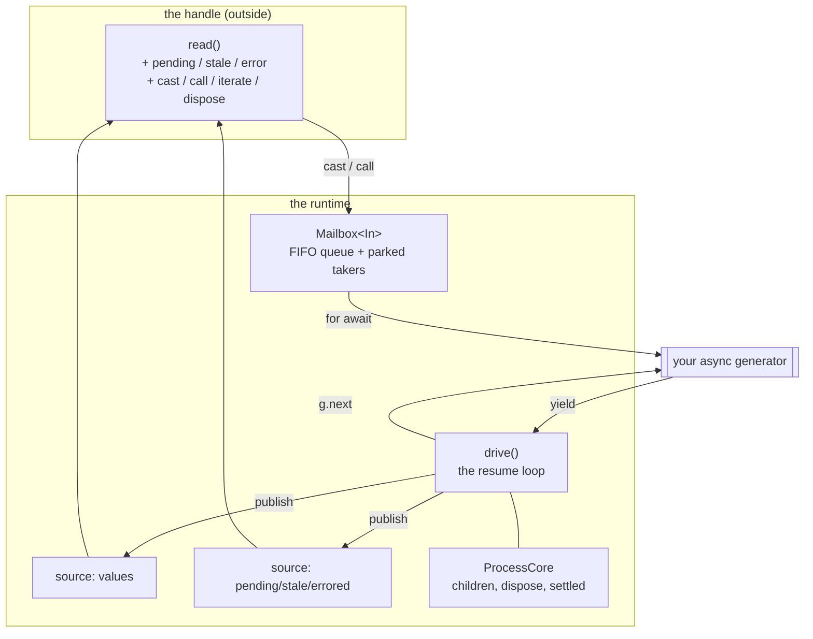
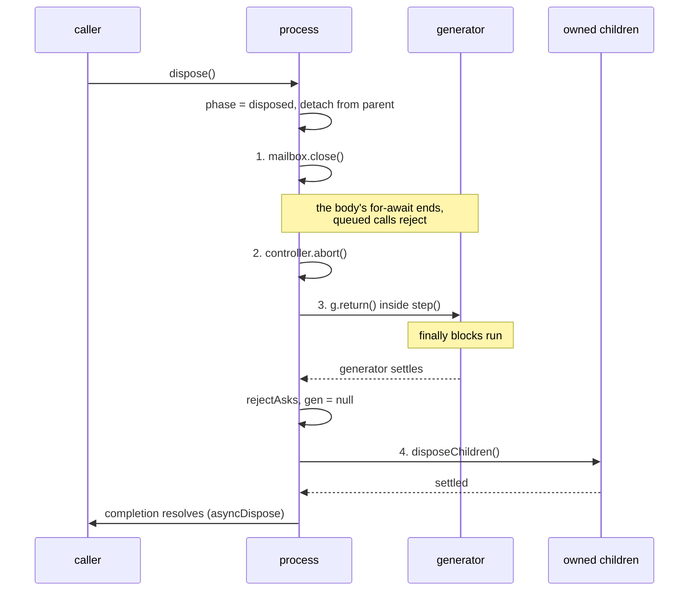

# process.ts: the runtime

`packages/core/src/process.ts`. Imports `graph.ts` and `reconcile.ts`; imported
by `registry.ts` and `index.ts`. This is where an async generator becomes a
running thing with state, a mailbox, a lifetime, and children.

`spawnProcess` builds five collaborating pieces:



**Every yield goes through a graph `source`.** The local update path therefore
matches the wire path: `reconcile` runs on either type of yield. As a result, a remote process behaves like a
local one and why remote reads are as fine-grained as local ones.

## Two sources per process

Values and lifecycle are separate sources, so a reader that only watches
`pending` doesn't wake on every value, and vice versa.

`meta` holds `{ pending, stale, errored }`. `setMeta` compares all three fields
and returns early if nothing changed, so no-op transitions publish nothing.

The watcher count the registry refcounts is the **sum** of both sources'
watchers (`valueWatchers + metaWatchers`); either kind of subscription keeps a
shared process alive.

`error` is a closure variable rather than part of the published metadata. The
getter reads `meta().errored` purely to establish the subscription, then
returns the raw error. Errors are arbitrary values, not `Json`.

## The mailbox

FIFO queue plus a list of parked takers. Delivery rules:

- A push with a **non-`latest` taker parked** hands the message over directly.
- A push with a **`latest` taker parked** queues it and schedules a microtask
  drain, so same-tick casts can supersede each other before the taker sees
  one. Without that deferral, `latest()` would hand over the first message of a
  burst instead of the newest.
- `take(latest)` with a non-empty queue either shifts one message or drains to
  the newest (dropping the rest through `onDrop`).
- `take` on an empty queue reports **idle** (`pending: false`) and parks.

`bound` (`mailbox: n`) drops the **oldest** message on overflow, warns once,
and routes the dropped message through `onDrop`. Drop-oldest, not
drop-newest, ensuring that the latest input survives sustained overload.

`onDrop` is also how a dropped `call` rejects rather than hanging forever: every
in-flight call is registered in `pendingCalls` keyed by its message object, so
dropping that object rejects its promise.

`close()` resolves parked takers as done and drops the queue, ending the
generator's `for await` and rejects everything still queued.

## The drive loop

```mermaid
stateDiagram-v2
    [*] --> running: spawn
    running --> running: yield → publish → meta{pending:false, stale:false}
    running --> done: generator returns
    running --> crashed: throw, no restart budget
    running --> restarting: throw, restart 'on-crash'
    restarting --> running: fresh AbortController<br/>new generator from the same args<br/>same mailbox; queued casts replay
    running --> disposed: dispose()
    done --> [*]
    crashed --> [*]
    disposed --> [*]
```



Each iteration awaits `g.next()` inside `step()`, publishes the yielded value,
and clears the metadata flags. `r.done` ends the loop. **A process that returns is
over**, and its children go with it. That is why a view process that owns state
must idle on its mailbox instead of returning.

On a throw (and only if not already disposed): record the error, abort the
signal, reject pending calls, and dispose the crashed instance's children. Then
either restart (`restarts < maxRestarts`, default 3) or settle as `crashed`
with `stale: true, errored: true`. Readers keep the last good value throughout
because a crash makes the value stale rather than empty.

Restart is the Erlang position: re-run from the **init args**, not from the
crashed state. The mailbox survives, so queued casts replay into the fresh
instance. Pending calls do not replay because they already rejected.

## Ownership

`currentScope` is an ambient module-level pointer, set by `step()` only around
a resumption:

```ts
const step = <R>(fn: () => Promise<R>): Promise<R> => {
  const prev = currentScope
  currentScope = core
  try {
    return fn()          // returns at the generator's first await/yield
  } finally {
    currentScope = prev
  }
}
```

`fn()` returns as soon as the generator body hits its first `await` or `yield`,
so the scope covers exactly the **synchronous window** of that resumption. A
`spawn` after an intervening `await` in the same step runs unowned.

This is the library's sharpest edge. It is documented in the module header, in
[concepts.md](../concepts.md), and here, and the rule is one line: **spawn
before awaiting.** `unscoped()` is the explicit escape hatch used by the registry
wraps every spawn in it so shared state is never owned by whichever caller
happened to look it up first.

## Dispose ordering

The order is a contract, not an implementation detail:



`Symbol.dispose` starts teardown synchronously and returns; it cannot make an
awaited promise settle. `Symbol.asyncDispose` awaits `completion`, which
resolves only after the generator has settled *and* every owned child's
finalizer has settled (`await Promise.all([...childSettlements])`).

An operation that ignores `self.signal` and never settles will therefore block
async disposal because cancellation is cooperative.

Disposing an already-finished process still runs the teardown that is left:
mark stale, dispose children, and end every open async iterator through
`closers`.

## The outside face

The handle *is* the read function, with everything else installed onto it:

```ts
const read = (): T | undefined => src() as unknown as T | undefined
Object.defineProperties(read, { pending: …, stale: …, error: … })
p['cast'] = …; p['call'] = …
p[Symbol.asyncIterator] = …; p[Symbol.dispose] = …; p[Symbol.asyncDispose] = …
```

Calling the handle is a source read, so it is tracked inside a derive, effect,
or binding and a snapshot read anywhere else. The process handle
inherits path precision for free from [graph.ts](graph.md).

`call(msg)` builds `{ ...msg, reply }`, registers the rejector under that exact
object, and pushes it. The generator sees a message carrying `reply`;
calling it deletes the entry and resolves. Calls on a non-running process reject
immediately.

`Symbol.asyncIterator` returns an independent, **lossy** subscription: one
buffered slot, overwritten by newer values, deduplicated with `Object.is`. It
subscribes to both sources as subtree dependencies (reading the whole object,
letting it escape), so it wakes on every yield and every lifecycle transition.
Latest-value delivery is the default for state synchronization and is also what the wire
host needs, because patches computed between consecutively *observed*
snapshots always compose.

## Tests

`process.test.ts` (lifecycle, mailbox order, `latest()` conflation, crash and
restart, ownership, call rejection paths), `process.leaks.test.ts` (nothing
retained after disposal. This test needs `gc({ execution: 'async' })`, since plain `gc()`
false-fails under V8 conservative stack scanning), `types.check.ts` (the
`@ts-expect-error` lines are regression checks for the type
surface).

Next: [registry.md](registry.md) covers naming, sharing, and eviction.
