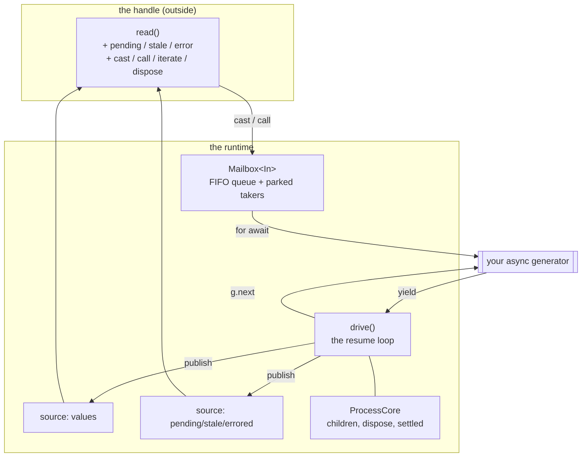
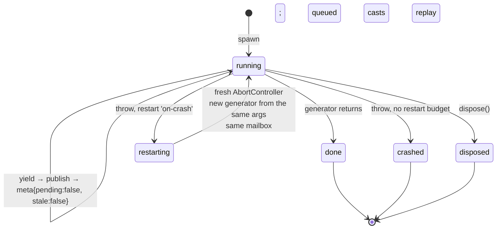
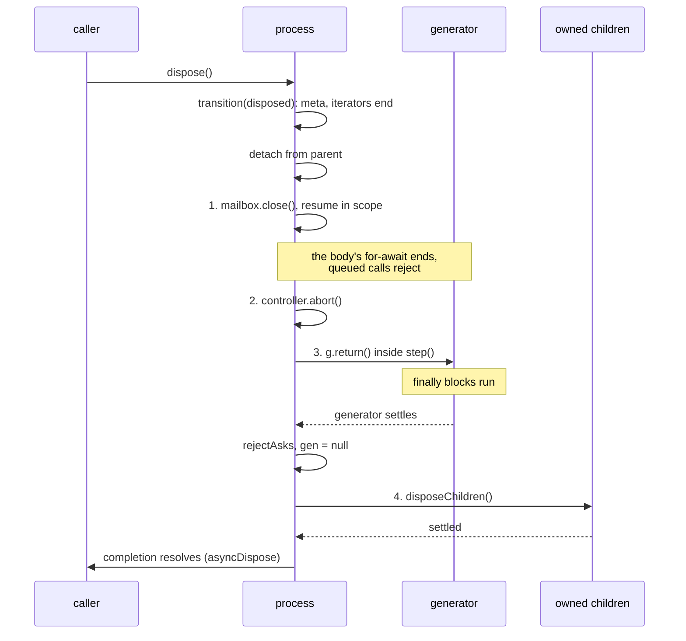

# process.ts: the runtime

`packages/core/src/process.ts`. Imports `graph.ts` and `reconcile.ts`; imported
by `registry.ts` and `index.ts`. This is where an async generator becomes a
running thing with state, a mailbox, a lifetime, and children.

`spawnProcess` builds five collaborating pieces:


```mermaid
flowchart TD
    subgraph handle["the handle (outside)"]
        READ["read()<br/>+ pending / stale / error<br/>+ cast / call / iterate / dispose"]
    end
    subgraph runtime["the runtime"]
        MB["Mailbox&lt;In&gt;<br/>FIFO queue + parked takers"]
        DRIVE["drive()<br/>the resume loop"]
        SRC["source: values"]
        META["source: pending/stale/errored"]
        CORE["ProcessCore<br/>children, dispose, settled"]
    end
    GEN[["your async generator"]]

    READ -->|cast / call| MB
    MB -->|for await| GEN
    DRIVE -->|g.next| GEN
    GEN -->|yield| DRIVE
    DRIVE -->|publish| SRC
    DRIVE -->|publish| META
    SRC --> READ
    META --> READ
    DRIVE --- CORE
```

**Every yield goes through a graph `source`.** The local update path therefore
matches the wire path: `reconcile` runs on either type of yield. That is why a
remote process behaves like a local one, and why remote reads are as
fine-grained as local ones.

## Two sources per process

Values and lifecycle are separate sources, so a reader that only watches
`pending` doesn't wake on every value, and vice versa.

`meta` holds `{ pending, stale, errored }`. `setMeta` compares all three fields
and returns early if nothing changed, so no-op transitions publish nothing.

The watcher count the registry refcounts is the **sum** of both sources'
watchers (`valueWatchers + metaWatchers`); either kind of subscription keeps a
shared process alive.

`error` is a closure variable rather than part of the published metadata. The
getter reads `meta().errored` purely to establish the subscription, then
returns the raw error. Errors are arbitrary values, not `Json`.

## The mailbox

A FIFO queue plus a FIFO of parked takers. Both are `Fifo`s: an array with a
moving head index that compacts once the consumed prefix reaches half the
array, so a dequeue is O(1) amortized at any depth (`Array#shift` is O(n) and
made a 100k-deep drain quadratic; `process.lifecycle.test.ts` drains 200k
queued casts under a time bound). A dequeued slot is cleared at once, so a
consumed message is not retained by the backing array
(`process.leaks.test.ts`). Delivery rules:

- A push with a **non-`latest` taker parked** hands the message over directly.
- A push with a **`latest` taker parked** queues it and schedules a microtask
  drain, so same-tick casts can supersede each other before the taker sees
  one. Without that deferral, `latest()` would hand over the first message of a
  burst instead of the newest.
- `take(latest)` with a non-empty queue either shifts one message or drains to
  the newest (dropping the rest through `onDrop`).
- `take` on an empty queue reports **idle** (`pending: false`) and parks.

`bound` (`mailbox: n`) drops the **oldest** message on overflow, warns once,
and routes the dropped message through `onDrop`. Drop-oldest, not
drop-newest, ensuring that the latest input survives sustained overload.

`onDrop` is also how a dropped `call` rejects rather than hanging forever: every
in-flight call is registered in `pendingCalls` keyed by its message object, so
dropping that object rejects its promise.

`close()` resolves parked takers as done and drops the queue, ending the
generator's `for await` and rejecting every call still queued. It takes an
optional wrapper around the taker resolution; disposal uses it to resume the
body in scope (see [Ownership](#ownership)).

## The drive loop


```mermaid
stateDiagram-v2
    [*] --> running: spawn
    running --> running: yield → publish → meta{pending:false, stale:false}
    running --> done: generator returns
    running --> crashed: throw, no restart budget
    running --> restarting: throw, restart 'on-crash'
    restarting --> running: fresh AbortController<br/>new generator from the same args<br/>same mailbox; queued casts replay
    running --> disposed: dispose()
    done --> [*]
    crashed --> [*]
    disposed --> [*]
```

Each iteration awaits `g.next()` inside `step()`, publishes the yielded value,
and clears the metadata flags. `r.done` ends the loop. **A process that returns is
over**, and its children go with it. That is why a view process that owns state
must idle on its mailbox instead of returning.

The call `proc(self, args)` sits inside the loop's `try`: a throw while
binding the generator's parameters (a destructuring default, say) is a crash
like any other, not a process stuck at `pending` with an unhandled rejection.

**Every exit from `running` goes through `transition(to, meta)`**: it sets the
phase, publishes the final metadata, and ends every open async iterator. That
is the only place the phase changes, and the loop publishes a value only while
the phase is `running`. A body that was parked at a foreign `await` when it
was disposed may still reach a `yield` on its way out; that value is dropped,
so it cannot flip `stale` back to false. Iterators end through the closer
list rather than by watching metadata, so a process that returns while
already idle (no metadata change at all) still ends its iterators.

On a throw (and only while `running`): record the error, abort the signal,
remove queued calls from the mailbox, reject every pending call, and dispose
the crashed instance's children. Then either restart (`restarts < maxRestarts`,
default 3) or settle as `crashed` with `stale: true, errored: true`. Readers
keep the last good value throughout because a crash makes the value stale
rather than empty. The phase, not the error value, says whether the process
crashed, so `throw undefined` is a crash like any other.

Restart is the Erlang position: re-run from the **init args**, not from the
crashed state. The mailbox survives, so queued casts replay into the fresh
instance. Calls do not: every call is registered in `pendingCalls` under its
message object, and on a crash the mailbox is filtered against that map before
the calls reject, so a call queued behind the crash is never executed by the
restarted instance (`process.lifecycle.test.ts`).

### Observing crashes

`onProcessError(handler)` (exported from the package root) installs one global
handler that sees every crash, including those a restart recovers from, as
`(error, name)`, where `name` is the proc's function name. It returns a remover.
There is no default handler; without one, a crash is visible only on the handle
(`error`, `stale`) and in rejected calls, as before. The handler runs a
microtask after the crash, so a handler that throws surfaces as an unhandled
rejection instead of wedging the drive loop. One slot rather than a listener
set keeps it cheap; fan out in userland if you need more.

## Ownership

`currentScope` is an ambient module-level pointer, set by `step()` only around
a resumption:

```ts nocheck
const step = <R>(fn: () => Promise<R>): Promise<R> => {
  const prev = currentScope
  currentScope = core
  try {
    return fn()          // returns at the generator's first await/yield
  } finally {
    currentScope = prev
  }
}
```

`fn()` returns as soon as the generator body hits its first `await` or `yield`,
so the scope covers exactly the **synchronous window** of that resumption. A
`spawn` after an intervening `await` in the same step runs unowned.

This is the library's sharpest edge. It is documented in the module header, in
[concepts.md](../concepts.md), and here, and the rule is one line: **spawn
before awaiting.** `unscoped()` is the explicit escape hatch: the registry
wraps every spawn in it so shared state is never owned by whichever caller
happened to look it up first.

**Spawns during teardown.** The one resumption the runtime extends the scope
to is the one disposal causes by closing the mailbox. A body parked on its
mailbox (the usual place) resumes when `close()` resolves its taker, and that
resumption is a promise reaction outside any `step()`. Disposal therefore
brackets the resolution with two microtasks, scope on and scope off. Microtasks
run FIFO, so the body's resumption runs between them, and a `finally` that
spawns before its own first `await` attaches the child to the dying process.
`drive()` disposes it with the other children, and `asyncDispose` waits for it.
A `finally` reached after a foreign `await` (a fetch, a timer) is not covered;
its spawns run unowned, as with any spawn after an await.

## Dispose ordering

The order is a contract, not an implementation detail:


```mermaid
sequenceDiagram
    participant U as caller
    participant P as process
    participant G as generator
    participant C as owned children

    U->>P: dispose()
    P->>P: transition(disposed): meta, iterators end
    P->>P: detach from parent
    P->>P: 1. mailbox.close(), resume in scope
    Note over P,G: the body's for-await ends,<br/>queued calls reject
    P->>P: 2. controller.abort()
    P->>G: 3. g.return() inside step()
    Note over G: finally blocks run
    G-->>P: generator settles
    P->>P: rejectAsks, gen = null
    P->>C: 4. disposeChildren()
    C-->>P: settled
    P->>U: completion resolves (asyncDispose)
```

`Symbol.dispose` starts teardown synchronously and returns; it cannot make an
awaited promise settle. `Symbol.asyncDispose` awaits `completion`, which
resolves only after the generator has settled *and* every owned child's
finalizer has settled (`await Promise.all([...childSettlements])`).

An operation that ignores `self.signal` and never settles will therefore block
async disposal because cancellation is cooperative.

Disposing an already-finished process still runs the teardown that is left:
mark stale (through `transition`) and dispose children.

## The outside face

The handle *is* the read function, with everything else installed onto it:

```ts nocheck
const read = (): T | undefined => src() as unknown as T | undefined
Object.defineProperties(read, { pending: …, stale: …, error: … })
p['cast'] = …; p['call'] = …
p[Symbol.asyncIterator] = …; p[Symbol.dispose] = …; p[Symbol.asyncDispose] = …
```

Calling the handle is a source read, so it is tracked inside a derive, effect,
or binding and a snapshot read anywhere else. The process handle
inherits path precision for free from [graph.ts](graph.md).

`call(msg)` builds `{ ...msg, reply }`, registers the rejector under that exact
object, and pushes it. The generator sees a message carrying `reply`;
calling it deletes the entry and resolves. Calls on a non-running process reject
immediately.

`Symbol.asyncIterator` returns an independent, **lossy** subscription: one
buffered slot, overwritten by newer values, deduplicated with `Object.is`. It
subscribes to the value source as a subtree dependency (reading the whole
object, letting it escape), so it wakes on every yield. Latest-value delivery
is the default for state synchronization and is also what the wire host needs,
because patches computed between consecutively *observed* snapshots always
compose.

The iterator is `iterate()` in `iterate.ts`, shared with `derive`. The owner
passes a `pull` function and a set of closers; `transition` calls every closer
when the process leaves `running`. A closer pulls once more, untracked, before
ending, so a value yielded just before the process returned is delivered
before `done` even if the effect flush has not run yet. An iterator opened on a
finished process yields the last value, then `done`. Concurrent `next()` calls
queue and settle in call order.

## Tests

`process.test.ts` (lifecycle, mailbox order, `latest()` conflation, crash and
restart, ownership, call rejection paths), `process.lifecycle.test.ts` (how a
process ends: iterators after return and crash, queued calls across a restart,
yields after dispose, teardown spawns, parameter-binding throws,
`onProcessError`, mailbox depth), `process.leaks.test.ts` (nothing
retained after disposal. This test needs `gc({ execution: 'async' })`, since plain `gc()`
false-fails under V8 conservative stack scanning), `types.check.ts` (the
`@ts-expect-error` lines are regression checks for the type
surface).

Next: [registry.md](registry.md) covers naming, sharing, and eviction.
