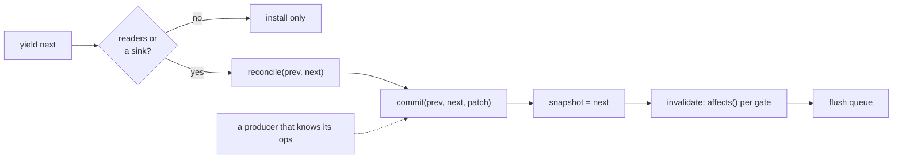

# Publication

A state transition reaches readers in two steps. **Discovery** works out what
changed: `reconcile(prev, next)` in `reconcile.ts`, which is pure and schedules
nothing. **Publication** installs the new snapshot and invalidates readers:
`commit(base, next, patch)` on a graph source, in `graph.ts`. `publish(next)`
is discovery followed by publication, and it is what every yield uses.

The split exists so that a producer that already knows its changes can skip
the diff. A persistent collection or a tracked editing session would be such
a producer, but neither exists yet: application code still writes
`yield state`, and every change still enters through a diff. The boundary is
internal. `source` and `commit` are not exported from `@nonchalant/core`.

## The contract

`commit(base, next, patch)` requires two things:

- `patch` takes `base` to `next`: `applyPatch(base, patch)` equals `next`.
  The ops may be more than the minimum (extra ops only cause extra wakes),
  but they must not leave out a change.
- `base` is the snapshot the source holds now. The check is `Object.is`. Snapshots are
  immutable, so the same reference is the same state, and a patch depends only on the
  value it applies to, so an equal primitive counts as the same base too. A stale
  base throws before anything is installed.

No revision number is involved, and the wire protocol is unchanged.

Invalidation is the loop that used to sit inside `publish`, moved without
changes. The snapshot is assigned first, so a reader that wakes sees the new
state. An empty patch wakes no one. A gate whose reader is in the middle of a
run parks the ops, and `finalizeGates` judges them once that run's paths are
sealed ([graph.md](graph.md#the-mid-run-publish-problem)).

A source with no gates installs `next` and never computes the diff, because
the only thing a patch is used for there is matching it against gates. A
reader that arrives later records its reads against whatever snapshot is
current at that point.

## What an op means to a reader

`paths.ts` is the one place that decides which recorded reads an op affects.
A producer must never implement its own matching. The rules are listed in
[tracking.md](tracking.md#matching-a-patch-against-a-tree). Two of them matter most for
producers other than the diff:

- **An array `del` counts as a one-element splice.** It wakes any reader that
  read `length`, iterated the array, or read an index at or after the deleted
  one, because those elements shift. `reconcile` never emits an array `del`,
  but `applyPatch` and the wire spec accept one. Before the split this rule was
  missing, and nothing noticed because every change went through a diff
  first.
- **A splice wakes positional reads at or after its start**, however far past
  the edit they are, and it wakes readers of `length` and iteration. Reads
  before the start stay asleep.

Ops are judged one at a time, in the order they apply, and each op is
evaluated against the state it applies to. That is enough for a whole patch or
a series of patches: an index can move only at or after a splice point (or an
array `del`), and those same ops already wake every reader of an index there.
Unshifted positions keep their coordinates. Parked ops from several publishes
are judged by the same rule.

A replay op and an invalidation are the same `Op` value. The only form kept
for invalidation is the parsed segment list (`segsList`), built once per
publication and not stored. No separate invalidation type exists, because
nothing would get simpler or faster with one.

## The paths in

| path | discovery | publication | notes |
|---|---|---|---|
| local yield (`process.ts`) | `reconcile(prev, next)`, only when the source has gates or an instrument sink is installed | `src.commit(prev, next, ops)` | with a sink, the diff runs once and the sink's `yield` event carries the same ops readers are invalidated with (before this change, it ran twice) |
| incoming wire patch (`wire/pump.ts`) | `applyPatch` rebuilds the next state, then the pump yields it, so a local diff runs again | as a local yield | the second diff is kept on purpose; see below |
| reconnect snapshot | the host sends `[['set', '', state]]` measured from nothing, the pump rebuilds from `null`, and the local diff compares against the value it kept | as a local yield | the diff is what lets readers of unchanged paths sleep through a reconnect, so it must stay |
| inspector replay (`inspect/recording.ts`) | ops recorded from the sink | none: `applyPatch` into its own recording, which is plain data | time travel folds patches into a base and does not touch the graph |
| host watch (`wire/watch.ts`) | `reconcile` between consecutive *observed* snapshots | encoded onto the transport | this is where publications merge together (see batching) |

### Why the pump still diffs

An incoming patch does describe the transition it installs, and it could feed
`commit` safely when the pump's running snapshot is the source's current one.
It still goes through the diff for three reasons:

- **The base is wrong after a reconnect.** A restarted pump rebuilds from `null`
  while the source still holds the value it had before, so the patch's base
  is not the source's snapshot. Invalidating by the root `set` would wake
  every reader, where today the diff wakes only readers whose paths actually
  changed.
- **Wake counts would depend on the host.** The reference host sends minimal
  diffs, but the spec allows patches that are larger than necessary, and
  JSON loses some distinctions (`undefined` and `-0`). Invalidating by the
  patch received would turn any non-minimal op into extra wakes that the
  local diff avoids.
- **Wire would need a way into core.** The pump is ordinary generator code in
  another package. Passing the patch in would take an exported hook, which
  is effectively public API.

On one machine, the second diff costs about as much as `reconcile` on the
same shape: tens of µs for one changed row in 10,000. The first thing to try,
if profiling shows remote sparse edits are bound by this diff, is to feed the
patch in when the base matches and fall back to the diff after a restart.

## Batching and retention

Effect batching and dropping intermediate publications are different
mechanisms:

- **Effects batch.** Each commit installs its snapshot and bumps gates right
  away. Effects run once per microtask flush and read the latest snapshot.
  Nothing is dropped: every commit is matched against every gate, so a burst
  of commits wakes the union of what each one would have woken.
- **Iteration merges publications.** An async iterator over a process delivers
  the latest value it has not yet delivered and skips the ones in between. Its
  consumers must not rely on the patch of the last publication alone. The host watch
  diffs each observed snapshot against the one it saw before (`prev` in
  `wire/watch.ts`), so what it sends always composes from the client's last
  state. No history is kept and no patches are composed, and this change
  adds neither.

Retention:

- A source holds one snapshot.
- A gate holds its reader's sealed `PathTree`, which contains no proxies and
  no values, and holds ops only while its reader is mid-run. `finalizeGates`
  clears them.
- `commit` holds nothing after it returns.
- The instrument sink receives ops that share structure with `next`. The
  inspector keeps them in a bounded ring (`inspect/ring.ts`).
- The host watch and the iterator each hold one value, the last they
  observed.

## Tests

`packages/core/test/commit.test.ts` covers the boundary with a private
producer that edits a state op by op (set, del, splice, array `del` included)
and passes `next` plus the ops to `commit`:

- after a flush, every reader matches the new snapshot read raw
  (property-tested over random states, edits, and read shapes: leaves,
  missing keys, presence checks, keys and length, iteration, whole subtrees);
- given the diff as its patch, `commit` wakes exactly the readers `publish`
  does;
- several commits before one flush lose nothing;
- a stale base is refused, and a no-op transition wakes no one;
- a commit that lands mid-run is judged against what the run reads next.

`paths.test.ts` checks the array-`del` rule against hand-built path trees. In
`instrument.test.ts`, "diffs a yield only when something consumes the patch"
pins the number of diffs per yield: 0 with no reader and no sink, 1 with
either. `process.leaks.test.ts` pins that ops parked for a mid-run reader, and the values they
carried, are released once judged.

Next: [graph.md](graph.md) for how gates are woken, [tracking.md](tracking.md)
for what a read records.
