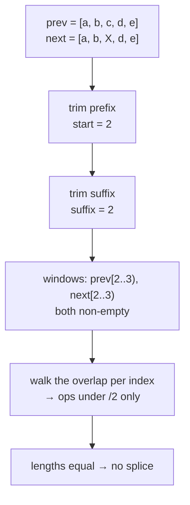

# reconcile.ts: the structural diff

`packages/core/src/reconcile.ts`. No internal imports; everything else in core
sits on top of it.

Two pure functions and an op vocabulary:

```ts
reconcile(prev: Json, next: Json): Patch    // diff
applyPatch(doc: Json, patch: Patch): Json   // apply, without mutating anything
```

The same patch travels three distances: to a local reader (the graph tests it
against recorded read-paths), to the DOM (a region reconciles its children),
and across a socket (the wire codec validates exactly these op shapes). There
is one diff in the system, and this is it.

## The op vocabulary

| op | shape | meaning |
|---|---|---|
| `set` | `['set', path, value]` | the value at `path` is now `value` |
| `del` | `['del', path]` | the key at `path` is gone |
| `splice` | `['splice', path, start, remove, insert]` | the array at `path` had `remove` elements at `start` replaced by `insert` |

Paths are RFC 6901 JSON pointers (`/items/3/done`), with `~` escaped as `~0`
and `/` as `~1`. The root is the empty string.

This format differs from RFC 6902 JSON Patch by including `splice`, which lets a
JSON Patch representation of "insert one row at the front of a 10,000-item
list" is 10,000 index rewrites, while `splice` is one op whose size is the
inserted slice. Since the wire carries these ops verbatim, the op set is a
protocol decision rather than only an implementation detail. Changing it means
changing `packages/wire/spec/`.

## Identity is the base case

`walk()` opens with `Object.is(prev, next)` and returns immediately on a hit.
Everything about the library's performance follows from that one line: if you
build the next state by spreading and reusing the parts that didn't change,
the diff never descends into the reused parts. Cost is proportional to what
changed, not to the size of the state.

The mutate-then-clone anti-pattern defeats exactly this: a deep clone shares
no identity, so every node is "changed" and the diff walks the whole tree.
That is the ~4,900 µs row in [concepts.md](../concepts.md).

Path strings are built only along the changed spine. `${path}/${key}` is
constructed after the identity check fails, never for the untouched
neighbours (measured ~5× on 10k items).

## Objects

Keys present in `prev` but not `next` emit `del`. Keys in `next` are compared
by identity; a changed key recurses if it existed before, and emits `set` if
it is new.

The membership test is `Object.hasOwn`, never `in`. With `in`, a key like
`toString` would find `Object.prototype`'s method and the diff would conclude
the key already existed, which would corrupt the patch for state that uses
prototype-shadowing key names. `applyPatch` guards the mirror image by writing
through `Object.defineProperty` rather than assignment, so a `__proto__` key
in the data cannot reach the prototype chain.

## Arrays: trim, then walk

The array case exists to keep list edits proportional to the edit. It trims
the identity-shared prefix and suffix first, so a contiguous insertion or
removal collapses into a single `splice`:



Three outcomes after trimming, in the order the code tests them:

- **Prefix window empty in `prev`** (`start === pEnd`): pure insertion. One
  `splice` inserting the middle of `next`.
- **Window empty in `next`** (`start === nEnd`): pure removal. One `splice`
  removing that range.
- **Both windows non-empty:** indices agree in both coordinate systems across
  the overlap, so the overlap is walked per index, and one trailing `splice`
  accounts for any length difference.

When reading a patch, note that an edit *and* a length
change in the same yield produce per-index ops plus one splice, not a single
fused op. Minimality is asserted per-shape in `reconcile.test.ts`, not claimed
in general.

## applyPatch is pure

`applyPatch` copies every container it descends through and never touches the
input document, the patch, or the values inside the patch. That purity is what
makes it safe on the client, where the previous snapshot is still being read
by live bindings while the next one is being built. This is the same
structural-sharing discipline the docs ask of application code, applied
internally.

It is strict about malformed input: a path that descends into a non-container,
an out-of-range array index, a `del` of a missing key, a splice range past the
end, or an invalid `~` escape all throw. The wire's decoder does a structural
pre-check of the same constraints (`protocol.ts`), so a hostile peer's patch is
rejected at the codec rather than half-applied.

Round-tripping is the property test: for random `prev`/`next` pairs,
`applyPatch(prev, reconcile(prev, next))` must deep-equal `next`
(`reconcile.test.ts`).

## Budget

1 change in a 10,000-item list must diff in ≤ 100 µs, asserted in
`packages/core/test/reconcile.perf.test.ts`. It is a CI assertion, not a
guideline. Tighten it if you make the diff faster; do not loosen it to make a
change fit.

Next: [tracking.md](tracking.md) explains how a reader records what it read so a
patch can be matched against it.
