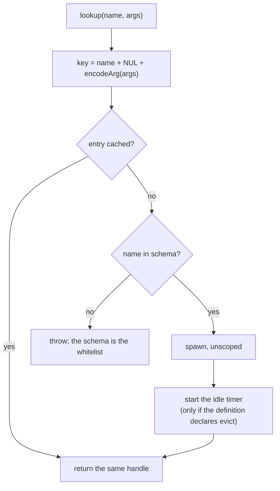

# registry.ts: naming, sharing, and eviction

`packages/core/src/registry.ts`. Imports `process.ts`. The smallest module with
the largest design claim: `lookup(name, args)` is get-or-spawn, and that one
operation provides dependency injection, process caching, and remote addressing
when a transport is involved.

The new-concept bar in `CLAUDE.md` says a public concept must dissolve at least
two existing problems. This is the one that earned its place by dissolving
three.

## Lookup

Two properties fall out of the cache being keyed on `name + args`:

- The same key returns the same handle, so every caller shares one process. This makes
  it dependency injection without prop drilling.
- Different arguments return a different process, providing query-cache
  (`name + args` is the queryKey).

The schema lookup doubles as the security whitelist: a name that isn't in
`defs` throws, so nothing outside the schema can be spawned locally or by a
remote peer through `expose()`.

Registry spawns are wrapped in `unscoped()`. Shared state must not be owned by
whichever process happened to look it up first, or the second caller's handle
would die when the first caller did. This is the one place ambient ownership is
suspended (see [process.md](process.md)).

## Key encoding

`encodeArg` is a structural serialiser, not `JSON.stringify`. The differences
all matter:

| input | encoded as | why |
|---|---|---|
| `{ a: 1, b: 2 }` / `{ b: 2, a: 1 }` | same string (keys sorted) | argument order must not split the cache |
| `1` vs `'1'` vs `true` | type-tagged (`number:1`, `string:"1"`, `true`) | no collisions across types |
| `NaN`, `±Infinity`, `-0` | explicit tokens | `JSON.stringify` turns these into `null`/`0` |
| `undefined` vs missing | `undefined` | distinguishable |
| `bigint`, `symbol` | tagged; symbols get a stable id | not JSON-representable |
| a cycle | `cycle:<id>` | encoding must terminate |
| class instance, `Map`, `Date`, function | identity id from a `WeakMap` | no structural identity to rely on |

The identity fallback means that two structurally identical `Date`
arguments are *different* cache keys, because the encoder cannot know whether
a non-plain type's structure defines its identity. Plain-data arguments are the
supported path. This matches the rule used by the rest of the library and explains why
the same key works over the wire.

The separator between name and encoded args is a NUL character, which no
realistic schema name contains, preventing one name/args pair from colliding with a
differently-split one.

## Lifecycle

```mermaid
stateDiagram-v2
    [*] --> Live: lookup; spawn and start idle timer
    Live --> Watched: a watcher subscribes<br/>(timer cleared)
    Watched --> Watched: more watchers come and go
    Watched --> Idle: last watcher leaves<br/>(timer restarts)
    Idle --> Watched: a watcher subscribes
    Idle --> [*]: timer fires; dispose and forget
    Live --> [*]: process returns (onSettled)<br/>or evict(name, args)
```

**Watchers are subscriptions, not reads.** Effects, derives, and iterators that
read either the value or the lifecycle metadata create gates
([graph.md](graph.md)); their total is the refcount. A plain snapshot pull is
not watching. That is SWR semantics on purpose: an evicted entry simply
respawns on the next lookup, so a caller who only pulls occasionally is not
holding a process open.

The idle timer, when there is one, **starts at lookup** rather than when the
first watcher leaves. A process that is looked up and never watched therefore still
evicts. It is cleared when the count goes above zero and restarted when it
returns to zero.

There is a timer only when the definition declares `evict`. Without it the
entry has no idle timeout at all and stays resident until the process ends or
someone calls `evict()`. This is the appropriate default for state that should
outlive its watchers, and a leak for state that shouldn't. It is also what a
remote `exit` does *not* do: releasing the last watch reclaims the process only
if its definition opted in (see [PROTOCOL.md](../PROTOCOL.md)).

`onSettled` handles the other exit: a process that returns or crashes
terminally removes its own entry, so the next lookup starts fresh rather than
handing out a finished process. Both `onSettled` and the eviction timer check
`entries.get(key) === created` before acting, so a stale callback from a
superseded entry cannot delete its replacement.

`evict(name)` drops every entry under a name; `evict(name, args)` drops one.
Both dispose immediately rather than waiting for the timer.

## Where this shows up elsewhere

`RegistryHandle` and the remote `Connection` implement the same `Registry`
interface, which is what "a name resolves identically at every distance" means
in practice. `connect(transport)` substitutes the transport and keeps the
interface. The remote side's cache is keyed the same way (canonicalised JSON
args in `wire/client.ts`), so client-side get-or-spawn behaves like the local
one.

`expose(reg, transport)` accepts anything with a `lookup` method, not a
`RegistryHandle` specifically. That is the seam the Node host's `scope` option
uses to give each connection its own gateway; see
[hosting.md](../hosting.md).

Tests: `packages/core/test/registry.test.ts` (key equivalence, sharing,
refcounting, eviction timing, respawn after eviction).

Back to the [overview](README.md).
