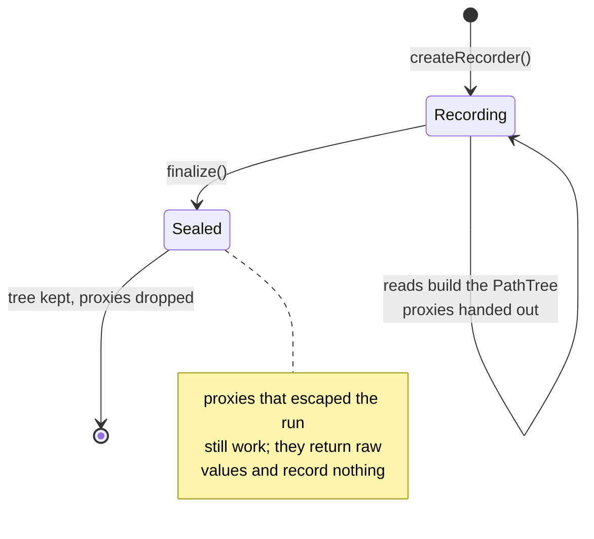
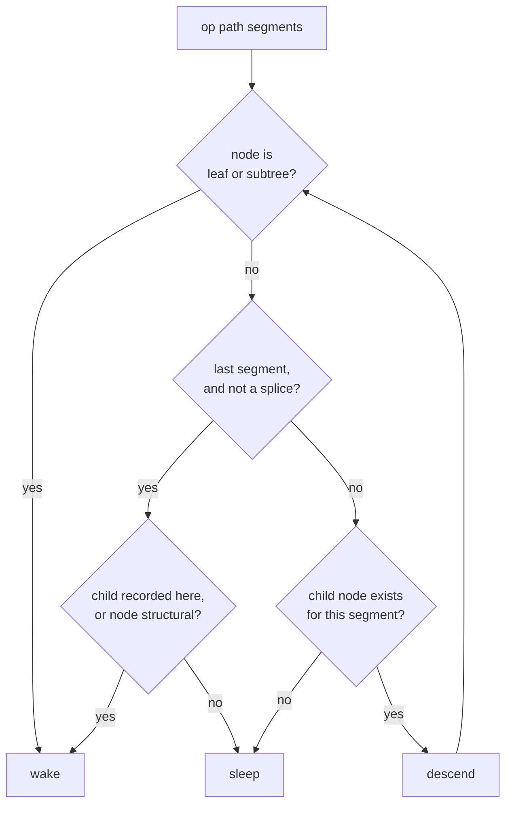

# track.ts: path recording and patch intersection

`packages/core/src/track.ts`. Imports only `reconcile.ts`. This is the "read
tracked" half of the granularity mechanism; [reconcile.md](reconcile.md) is the
"write plain" half.

The question this module answers: *given that these paths changed, does this
particular reader need to run again?*

```ts
createRecorder(): Recorder            // wraps snapshots for one reader run
recorder.wrap(snapshot): Json         // a recording proxy
recorder.finalize(): PathTree         // what the run touched
affects(tree, patch, segs): boolean   // does the patch intersect that tree?
```

## The recorder lifecycle

A `Recorder` belongs to one reader (an effect or a derive) and one run of that
reader. While it is open, every read through it is recorded into a `PathTree`.
`finalize()` seals the tree and flips the recorder into a pass-through.



Sealing drops every proxy reference the tree holds. That is a leak-avoidance
requirement, not an optimisation: the proxies close over the snapshot they
wrapped, so a retained tree would pin every historical snapshot a reader ever
saw. `process.leaks.test.ts` asserts nothing survives disposal.

Proxies handed out during the run may outlive it because application code can store
one. After `finalize()` the `get` trap short-circuits to `Reflect.get`, so a
stale proxy remains a read-only view with correct values and no phantom
dependencies recorded against a run that already ended.

## What a read establishes a dependency on

The tree carries four independent flags per node, because "this reader read
this path" is not one relationship:

| flag | set when | woken by |
|---|---|---|
| `leaf` | a primitive was read here, or an absent key was observed | any op at or below this path |
| `structural` | keys, `length`, or `in` were observed here | ops that change this node's key set |
| `traversed` | a container was obtained and read into | nothing by itself; only the reads beneath it matter |
| `subtree` | a container escaped the reader | any op at or below this path |

The key distinction is **traversed vs subtree**. A reader
that walks into `state.items[3].done` and reads a boolean depends on that
boolean, not on `items` or `items[3]`. A reader that grabs
`state.items` and hands it to something else (returns it, stores it, compares
it by identity) has let the whole subtree escape, and must wake for anything
underneath.

The proxy can see traversal directly. It cannot see escape: returning a value
is not a trappable operation. Escape is therefore inferred at `finalize()`. A node
that was traversed but has no recorded children and no other flags must have
been obtained without being read into, and is promoted to `subtree`.

That inference gives the documented approximation: **a container that is both
traversed and escaped records as traversal only.** Reading `items[0]` *and*
returning `items` records children, so the promotion doesn't fire, and a change
to `items[7]` will not wake that reader. It is a real (and deliberate)
imprecision, called out in the module header and here rather than papered over.

Two more subtleties the traps handle:

- **Absent keys are dependencies.** Reading a key that isn't there records a
  `leaf`, because its later appearance is a change this reader cares about.
- **Prototype methods pass through unwrapped.** `map`, `slice`, and friends
  are returned as-is; call sites keep `this` bound to the proxy, so the reads
  those methods perform still hit the traps.
- **Frozen data properties are a coarse fallback.** A proxy must return the
  exact value of a non-configurable, non-writable data property, so wrapping it
  would violate a language invariant. Such a subtree is recorded as `subtree`
  instead. This is less precise but remains correct.

Snapshots are read-only through the proxy: `set`, `defineProperty`,
`deleteProperty`, and `setPrototypeOf` all throw, pointing the caller at
yielding a new value instead of mutating the old one.

## Matching a patch against a tree

`affects(tree, patch, segsList)` walks each op's path segments down the tree
and answers on the first intersection. `segsList` carries pre-parsed paths so a
publish parses each path once, not once per watching reader.



Two cases need explicit handling at the end of a path:

- **`set`/`del` of a key** wakes if anything was recorded at or below that key,
  or if this node's key set was observed (`structural`). A new or removed key
  changes the key set.
- **`splice`** wakes on `leaf`, `structural`, or `subtree` here, and otherwise
  only if a recorded child index is at or after the splice point. Indices
  before the splice point neither shift nor change, so readers of those rows
  sleep through an insertion further down the list.

That last rule is what the DOM budget rests on: changing one label in a 50-row
list is one text write, and appending a row wakes no existing row's bindings.

## Cost

`affects` is O(ops × path depth) per watching reader, and `publish` scans every
gate, which is O(watchers). An inverted path index would make it O(affected), and the
source comment says so; it is headroom, not a fix, because the enforced budget
(`reconcile.perf.test.ts`) is met without it. Measure before adding an index.

Tests: `packages/core/test/graph.test.ts`, especially "path intersection boundaries
(affects)" pins the matching rules (splice start index, structural key
observation, absent keys, replaced ancestors), "notification precision (exact
wake counts per patch)" pins what wakes, and "source reads" covers proxy
read-only-ness and frozen snapshots.

Next: [graph.md](graph.md) explains how these trees become subscriptions.
