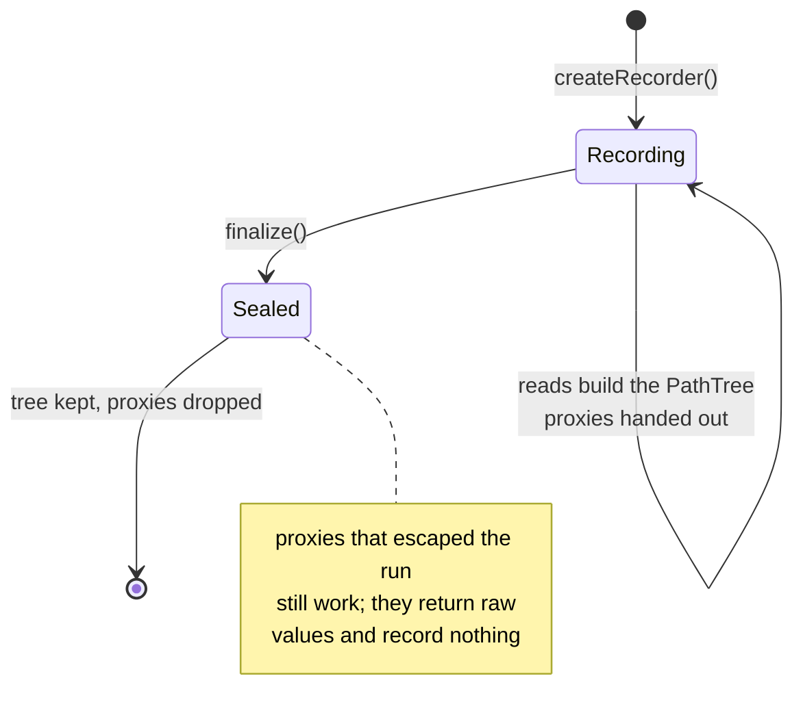
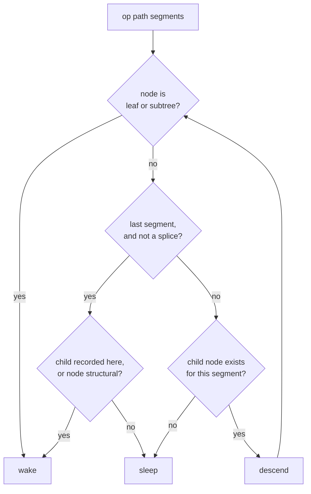

# track.ts: path recording and patch intersection

The "read tracked" half of the granularity mechanism;
[reconcile.md](reconcile.md) is the "write plain" half. Three modules in
`packages/core/src/`, none of which knows about the graph:

| file | holds |
|---|---|
| `track.ts` | the recorder and its proxy traps |
| `paths.ts` | `PathTree` and the patch matcher (`affects`, `opAffects`), pure |
| `unwrap.ts` | swapping proxies out of a computed's result, and the proxy → target map |

The question they answer: *given that these paths changed, does this
particular reader need to run again?*

```ts nocheck
createRecorder(): Recorder            // wraps snapshots for one reader run
recorder.wrap(snapshot): Json         // a recording proxy
recorder.finalize(): PathTree         // what the run touched
affects(tree, patch, segs): boolean   // does the patch intersect that tree?
```

## The recorder lifecycle

A `Recorder` belongs to one reader (an effect or a derive) and one run of that
reader. While it is open, every read through it is recorded into a `PathTree`.
`finalize()` seals the tree and flips the recorder into a pass-through.


```mermaid
stateDiagram-v2
    [*] --> Recording: createRecorder()
    Recording --> Recording: reads build the PathTree<br/>proxies handed out
    Recording --> Sealed: finalize()
    Sealed --> [*]: tree kept, proxies dropped
    note right of Sealed
        proxies that escaped the run
        still work; they return raw
        values and record nothing
    end note
```

Sealing drops every proxy reference the tree holds. That is a leak-avoidance
requirement, not an optimisation: the proxies close over the snapshot they
wrapped, so a retained tree would pin every historical snapshot a reader ever
saw. `process.leaks.test.ts` asserts nothing survives disposal.

Proxies handed out during the run may outlive it because application code can store
one. After `finalize()` the `get` trap short-circuits to `Reflect.get`, so a
stale proxy remains a read-only view with correct values and no phantom
dependencies recorded against a run that already ended.

A computed's return value never carries proxies out (`unwrap.ts`). `unwrap()`
walks whatever a derive's getter returns, but only when that run was handed a
proxy: `wrap` bumps a module counter (`handed`) each time it returns one, and
the computed compares the counter before and after its getter. A derive over a
primitive snapshot, or one that reads only primitives from a snapshot it never
receives as a container, skips the walk. It still checks, with one `WeakMap`
lookup (`unproxy`), whether the result *is* a proxy: one captured in an
earlier run and returned whole by a run that was handed nothing.
The walk replaces each proxy with the raw snapshot node behind it, using a
`WeakMap` from proxy to target that is filled as proxies are created. A proxy
is swapped whole, because its target is raw data all the way down. The plain
containers around it are patched in place (a frozen one keeps its proxies).
A plain container the walk finds proxy-free goes into a `clean` `WeakSet`
and is never walked again; one that held a proxy, directly or beneath, is
left out, so a getter that refills a reused container is walked again on its
next run. A large static table in a derive's result, or the structurally
shared part of a result built from the previous one, therefore costs one walk
ever, not one per recompute. Marking happens before descending, which also
makes cyclic results terminate.

The limit this leaves, deliberately: a container found proxy-free and *later*
mutated in place to hold a proxy is not walked again, so that proxy escapes
(it still reads correctly; it is only identity, `structuredClone` and
mutation that differ). Telling that container apart from a static table
would take a walk of every clean container on every recompute, which is the
cost `clean` exists to avoid. It is the mutate-in-place anti-pattern either
way; `unwrap.test.ts` pins the limit next to the cases that are covered.

So `derive(() => p().items.filter((x) => x.done))` holds the snapshot's own
items: identity matches untracked reads, `structuredClone` works, and a derive
that returns an unchanged subtree gives downstream readers an equality cut. A
proxy nested inside a non-plain object (a `Map`, a class instance) is not
unwrapped. Plain data is the supported path.

## What a read establishes a dependency on

The tree carries four independent flags per node, because "this reader read
this path" is not one relationship. A fifth kind of observation, presence, has
no flag at all:

| flag | set when | woken by |
|---|---|---|
| `leaf` | a primitive was read here, or an absent key was observed | any op at or below this path |
| `structural` | keys or `length` were observed here | ops that change this node's key set |
| *(a bare child node)* | `in`, `hasOwn`, or a property descriptor was observed for this key | a `set` or `del` at exactly this key, not changes beneath it |
| `traversed` | a container was obtained and read into | nothing by itself; only the reads beneath it matter |
| `subtree` | a container escaped the reader | any op at or below this path |

The key distinction is **traversed vs subtree**. A reader
that walks into `state.items[3].done` and reads a boolean depends on that
boolean, not on `items` or `items[3]`. A reader that grabs
`state.items` and hands it to something else (returns it, stores it, compares
it by identity) has let the whole subtree escape, and must wake for anything
underneath.

The proxy can see traversal directly. It cannot see escape: returning a value
is not a trappable operation. Escape is therefore inferred at `finalize()`. A node
that was traversed but has no recorded children and no other flags must have
been obtained without being read into, and is promoted to `subtree`.

That inference gives the documented approximation: **a container that is both
traversed and escaped records as traversal only.** Reading `items[0]` *and*
returning `items` records children, so the promotion doesn't fire, and a change
to `items[7]` will not wake that reader. It is a real (and deliberate)
imprecision, called out in the module header and here rather than papered over.

Two more subtleties the traps handle:

- **Absent keys are dependencies.** Reading a key that isn't there records a
  `leaf`, because its later appearance is a change this reader cares about.
- **Key observation stays shallow.** `Object.keys`, spread, and `for…in` ask for
  each key's property descriptor. If that recorded a `leaf` per key, then
  `Object.keys(state)` would subscribe to every value in the state. The `has`
  and `getOwnPropertyDescriptor` traps create the child node without setting
  a flag, so a `set` or `del` of that key still wakes the reader (the
  last-segment rule finds the child), and an op deeper down does not (the
  descent finds nothing beneath it).
- **Prototype methods pass through unwrapped.** `map`, `slice`, and friends
  are returned as-is; call sites keep `this` bound to the proxy, so the reads
  those methods perform still hit the traps.
- **Frozen data properties are a coarse fallback.** A proxy must return the
  exact value of a non-configurable, non-writable data property, so wrapping it
  would violate a language invariant. Such a subtree is recorded as `subtree`
  instead. This is less precise but remains correct.

Snapshots are read-only through the proxy: `set`, `defineProperty`,
`deleteProperty`, and `setPrototypeOf` all throw, pointing the caller at
yielding a new value instead of mutating the old one.

## Matching a patch against a tree

`affects(tree, patch, segsList)` (`paths.ts`) walks each op's path segments
down the tree with `opAffects` and answers on the first intersection.
`segsList` carries pre-parsed paths so a publish parses each path once, not
once per watching reader.


```mermaid
flowchart TD
    S["op path segments"] --> L{"node is<br/>leaf or subtree?"}
    L -->|yes| W["wake"]
    L -->|no| E{"last segment,<br/>and not a splice?"}
    E -->|yes| C{"child recorded here,<br/>or node structural?"}
    C -->|yes| W
    C -->|no| Z["sleep"]
    E -->|no| D{"child node exists<br/>for this segment?"}
    D -->|no| Z
    D -->|yes| S2["descend"] --> L
```

Two cases need explicit handling at the end of a path:

- **`set`/`del` of a key** wakes if anything was recorded at or below that key,
  or if this node's key set was observed (`structural`). A new or removed key
  changes the key set. On an array node a `set` of an index is always a
  replacement, because the diff changes an array's length only through
  `splice` and `applyPatch` rejects out-of-range indices. So a reader that
  only read `length` sleeps through it. On a record node, an added key and a
  replaced one look the same in the op, and both still wake a structural
  reader. Readers that enumerate keys also hold a presence node for each key,
  and that node wakes on a replacement anyway, so telling the two apart would
  add a walk of the previous snapshot per op and save nothing.
- **`splice`** wakes on `leaf`, `structural`, or `subtree` here, and otherwise
  only if a recorded child index is at or after the splice point. Indices
  before the splice point neither shift nor change, so readers of those rows
  sleep through an insertion further down the list.

That last rule is what the DOM budget rests on: changing one label in a 50-row
list is one text write, and appending a row wakes no existing row's bindings.

## Cost

`affects` is O(ops × path depth) per watching reader, and `publish` scans every
gate, which is O(watchers). An inverted path index would make it O(affected), and the
source comment says so; it is headroom, not a fix, because the enforced budget
(`reconcile.perf.test.ts`) is met without it. Measure before adding an index.

Tests: `packages/core/test/graph.test.ts`, especially "path intersection boundaries
(affects)" pins the matching rules (splice start index, structural key
observation, absent keys, replaced ancestors), "shape observations stay
shallow" pins presence-only key checks and array length readers, "notification
precision (exact wake counts per patch)" pins what wakes, "source reads"
covers proxy read-only-ness and frozen snapshots, and "derive returns raw
values" covers `unwrap`, and `graph.scale.test.ts` "settling a derive result
walks only what could hold a proxy" counts walk visits on a 10,000-row static
result (0 over a primitive source; one walk total over several recomputes
through a proxy). Each module also has a test of its own: `track.test.ts`
scripts reads through a recorder and asserts the exact tree `finalize()`
produces; `paths.test.ts` tables `opAffects` over hand-built trees;
`unwrap.test.ts` counts the walks behind the `clean` rule.

Next: [graph.md](graph.md) explains how these trees become subscriptions.
